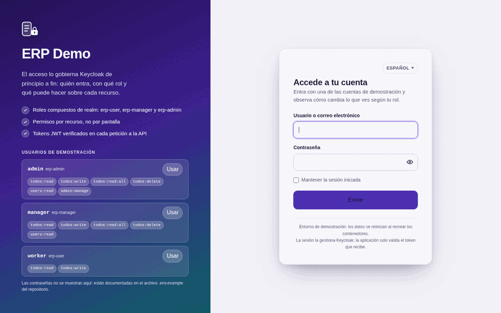
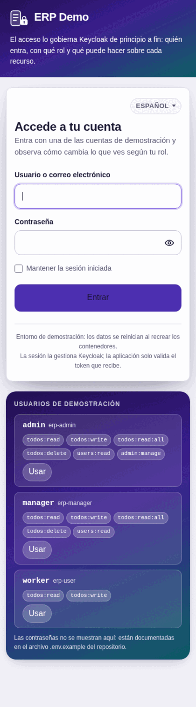
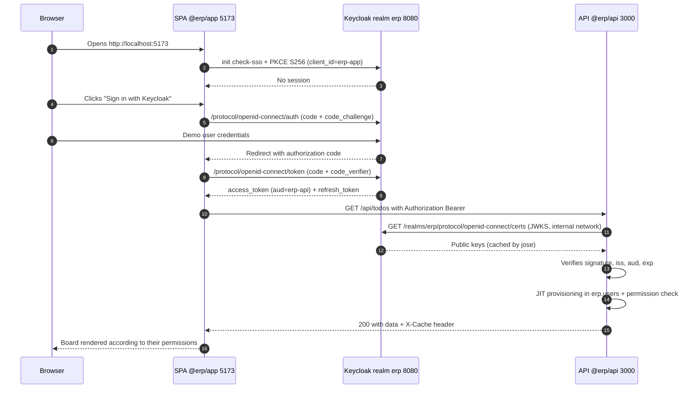
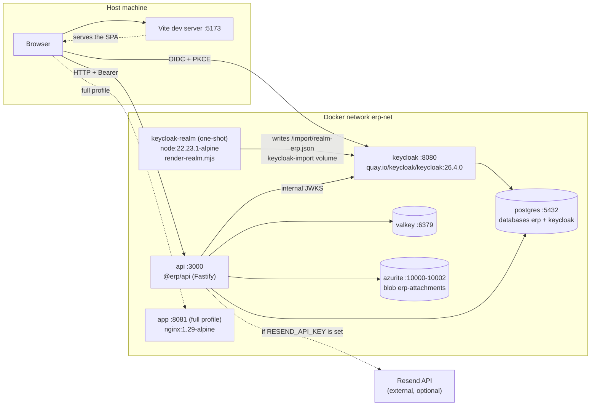
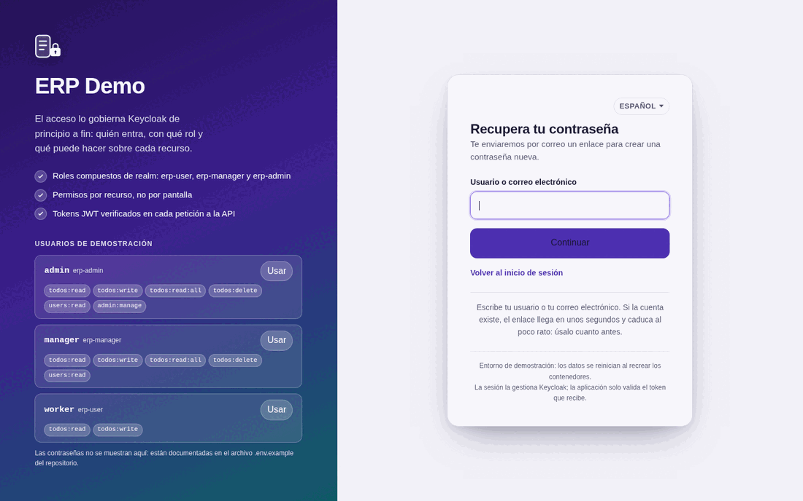
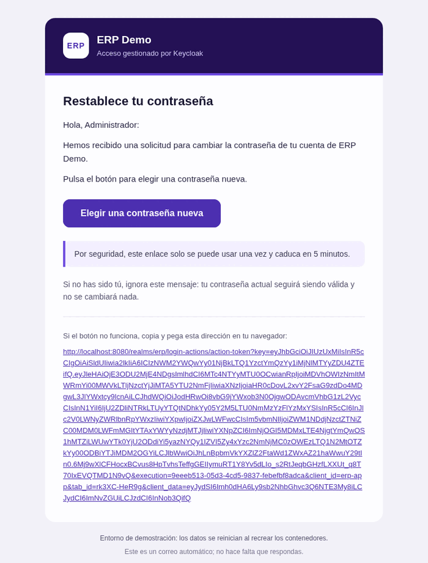

# ERP Demo with Keycloak

A **working, reproducible** demo of a mini-ERP (task / *todo* management) whose access control
lives entirely in **Keycloak**: the application stores no passwords, defines no users and decides
no roles. It only reads the permissions that arrive signed inside the *access token*.

The whole stack comes up with `docker compose` and behaves the same on every machine: pinned
versions, images with exact tags, a realm imported declaratively and database migrations
versioned with checksums.



> The login screen is a **custom Freemarker theme**, not Keycloak's. The cheat sheet on the left
> lists the three demo users with their permissions and fills the form when you press "Use": the
> whole point of the lab is that you compare, on the same screen, what changes depending on who
> you sign in as.

---

> [!WARNING]
> **This is a learning lab, not a production template.**
>
> - The credentials in `.env.example` (`Admin123!`, `erp_dev_password`, `erp_api_dev_secret`…)
>   are **local development values in plain sight for everyone**. Never reuse them.
> - The realm uses `sslRequired: "none"` and Keycloak runs in `start-dev`: no HTTPS, the admin
>   console wide open on `localhost:8080`, and no theme cache.
> - `bruteForceProtected` is off and sessions are long, so a demo never gets interrupted.
> - The only real secret in the project is `RESEND_API_KEY`, and it lives only in `.env`, which
>   is in `.gitignore` and **has never been committed**.
>
> To take anything from here into a real environment: HTTPS enforced, `start` instead of
> `start-dev`, brute-force protection, secrets in a secret manager and rotated credentials.

## What it demonstrates

- **OIDC + PKCE `S256`** from a React SPA against a public client (`erp-app`).
- **Business roles kept apart from technical permissions**: the realm roles
  (`erp-user`, `erp-manager`, `erp-admin`) are *composite* and pull in *client roles* of
  `erp-api` that act as fine-grained permissions (`todos:read`, `todos:delete`, `admin:manage`,
  …). Adding a permission does not force you to reassign users.
- **Token validation in the backend without a Keycloak library**: `jose` + remote JWKS, checking
  `iss` and `aud`.
- **Real authorization on the server** (`requirePermissions`) and **cosmetic authorization in the
  client** (`<Can perm="…">`): the UI hides, the API forbids.
- **Row-level visibility rules**: without `todos:read:all` you only see what is yours or what has
  been assigned to you; with that permission you see everything.
- **JIT user provisioning**: the first authenticated request creates/updates the row in
  `erp.users` using the token's `sub` as primary key.
- **Custom Freemarker login theme**: split screen with the demo user cheat sheet, inheriting from
  `base` and with no external dependencies ([detail](#custom-login-theme)).
- **Complete "I forgot my password" flow**: sent by Keycloak over SMTP, with the screens **and
  the email** styled by that same theme
  ([detail](#password-reset-i-forgot-my-password)).
- **English and Spanish on both front ends**, English by default
  ([detail](#interface-language)).
- Supporting infrastructure: **PostgreSQL 17**, **Valkey** (cache invalidated by version),
  **Azurite** (attachments in blob storage) and **Resend** (email, with a *dry-run* mode).

Detailed documentation:

- [`docs/architecture.md`](docs/architecture.md) — monorepo, components, database, cache and storage.
- [`docs/authentication.md`](docs/authentication.md) — roles, permissions, token contents and how to add a new permission.
- [`docs/operations.md`](docs/operations.md) — day-to-day commands, inspection and troubleshooting.

---

## Prerequisites

| Tool | Required version | How to check |
|---|---|---|
| Node.js | **22.23.1** (pinned in `.node-version`) | `node -v` |
| pnpm | **11.9.0** (pinned in `packageManager`) | `pnpm -v` |
| Docker Engine | 24+ with **Compose v2** (the `docker compose` subcommand, not `docker-compose`) | `docker compose version` |
| GNU Make | optional, only for the `make …` shortcuts | `make -v` |

If you use a version manager (`fnm`, `nvm`, `asdf`, `mise`), `.node-version` selects Node for you.
For pnpm, `corepack enable && corepack prepare pnpm@11.9.0 --activate` is enough.

Ports that must be free on the host: **5432, 6379, 8080, 3000, 5173, 10000, 10001, 10002**
(plus **8081** if you bring up the `full` profile).

---

## Quick start

```bash
# 1. Move to the repository root
cd /home/mapineda48/Repo/mapineda48/KeyCloak-Demo

# 2. Create your local .env from the versioned example
cp .env.example .env

# 3. Install the monorepo dependencies (uses the lockfile)
pnpm install

# 4. Bring up the infrastructure and the API (builds the project's own images)
docker compose up -d --build

# 5. Wait until Keycloak is healthy and the 'erp' realm has been imported
until curl -sf http://localhost:8080/realms/erp/.well-known/openid-configuration >/dev/null; do
  echo "waiting for Keycloak…"; sleep 2
done
echo "Keycloak ready"

# 6. Start the SPA in development mode
pnpm --filter @erp/app dev
```

7. Open **<http://localhost:5173>** and sign in with any of the [demo users](#demo-users).

Quick check that the backend is complete:

```bash
curl -s http://localhost:3000/health/ready | jq
# { "status": "ok", "checks": { "database": …, "cache": …, "storage": …, "mailer": … } }
```

> **Note:** step 4 is slow the first time (image downloads + API build). The `api` service depends
> on `postgres`, `valkey`, `azurite` and `keycloak` with `condition: service_healthy`, so if
> `docker compose ps` shows `api` up, everything else is already healthy.

### The "everything in containers" variant

To also serve the compiled SPA behind nginx (port **8081**), use the `full` profile:

```bash
docker compose --profile full up -d --build
# equivalent: pnpm run up:full   /   make up-full
```

In that mode the frontend configuration does not travel inside the bundle: nginx generates
`config.js` with `window.__ERP_CONFIG__` at startup from the environment variables.

---

## Services and URLs

| Service | URL / address | What for |
|---|---|---|
| Keycloak | <http://localhost:8080> | OIDC issuer of the `erp` realm |
| Keycloak admin console | <http://localhost:8080/admin> | Username/password = `KC_BOOTSTRAP_ADMIN_USERNAME` / `KC_BOOTSTRAP_ADMIN_PASSWORD` from `.env` |
| Realm OIDC metadata | <http://localhost:8080/realms/erp/.well-known/openid-configuration> | Endpoints and JWKS |
| API (`@erp/api`) | <http://localhost:3000> | REST under `/api`, health on `/health` and `/health/ready` |
| Swagger UI | <http://localhost:3000/docs> | Living documentation of every endpoint |
| SPA in development (Vite) | <http://localhost:5173> | `pnpm --filter @erp/app dev` |
| Compiled SPA (nginx, `full` profile) | <http://localhost:8081> | Only with `--profile full` |
| PostgreSQL | `localhost:5432` | Databases `erp` (application) and `keycloak` (identity) |
| Valkey | `localhost:6379` | Cache for todo listings |
| Azurite — Blob | `http://localhost:10000/devstoreaccount1` | Container `erp-attachments` |
| Azurite — Queue | `localhost:10001` | Unused, exposed for completeness |
| Azurite — Table | `localhost:10002` | Unused, exposed for completeness |

---

## Demo users

The three users are created declaratively when the realm is imported. **Their passwords are in
`.env.example`** (variables `DEMO_ADMIN_PASSWORD`, `DEMO_MANAGER_PASSWORD`,
`DEMO_USER_PASSWORD`); they are deliberately not repeated here, so that the environment file
stays the only place where they live.

| User | Realm role | Effective permissions (client roles of `erp-api`) | What they can do in the demo |
|---|---|---|---|
| `worker` | `erp-user` | `todos:read`, `todos:write` | See and edit **only their own** tasks and the ones assigned to them. Create, upload attachments, send email. **Cannot** delete or use `scope=all`. |
| `manager` | `erp-manager` | `erp-user` + `todos:read:all`, `todos:delete`, `users:read` | Everything above + see **all** tasks (`scope=all`), delete them and list users. No administration panel. |
| `admin` | `erp-admin` | `erp-manager` + `admin:manage` | Everything above + statistics and audit log (`/api/admin/*`) and the Administration section of the SPA. |

All three are created with `emailVerified: true`, `enabled: true` and a **non-temporary** password
(no forced change on first login). The realm's default role (`default-roles-erp`) includes
`erp-user`, so any new user is born with the basic permissions.

Emails: `DEMO_*_EMAIL` in `.env.example` (`admin@erp.local`, `manager@erp.local`,
`worker@erp.local`). They are fictional domains: good enough to exercise the notification flow,
useless for receiving real mail.

---

## Custom login theme

The sign-in screen is **not the one Keycloak ships**: the `erp` realm uses its own Freemarker
theme called **`erp`**, hand-written and free of external dependencies (no CDNs, no remote fonts).

### What you see

A **split screen**:

- **Left** — branding panel with a gradient: inline SVG logo, the *ERP Demo* title, a line
  reminding you that Keycloak governs access, three bullet points (composite roles, per-resource
  permissions, JWT tokens) and the **demo user cheat sheet**: `admin`, `manager` and `worker`,
  each with its realm role and its permissions as *chips*. Every card carries a button that
  **fills in the username field** and moves focus to the password.
- **Right** — the card with the sign-in form, vertically centred.

Below 900 px it collapses into a single column: the branding panel shrinks to a header
(logo + title) and the cheat sheet stays reachable under the form. There is a light and a dark
theme via `prefers-color-scheme`, and an **English/Spanish** language selector, because the realm
is imported with `internationalizationEnabled: true`, `supportedLocales: ["en", "es"]` and
`defaultLocale: "en"`.

<p align="center">
  
</p>

> **The theme contains no passwords.** The cheat sheet only writes the username; the demo users'
> passwords still live exclusively in `.env.example`.

To see it without going through the SPA, open <http://localhost:8080/realms/erp/account> in a
private window: the realm's account console demands a sign-in and uses this very theme.

### Where it lives

```
infra/keycloak/themes/erp/
├── theme.properties            # types=login
├── email/                      # password reset email (HTML + text) and its messages
└── login/
    ├── theme.properties        # parent=base, styles, scripts, locales and kc* class mapping
    ├── template.ftl            # split-screen layout (registrationLayout macro)
    ├── login.ftl               # sign-in form + demo user cheat sheet
    ├── footer.ftl  error.ftl  info.ftl
    ├── login-page-expired.ftl  logout-confirm.ftl
    ├── login-reset-password.ftl  login-update-password.ftl
    ├── messages/               # messages_en.properties + messages_es.properties
    └── resources/
        ├── css/erp-login.css
        └── js/erp-login.js
```

The directory is mounted into the container from `docker-compose.yml`:

```yaml
volumes:
  - ./infra/keycloak/themes:/opt/keycloak/themes:ro
```

Mounting on top of `/opt/keycloak/themes` is safe: in the official image that directory
**contains nothing but a README**. The built-in themes (`base`, `keycloak`, `keycloak.v2`) travel
inside the server JARs, so the mount hides nothing.

### What it inherits from `base`

`login/theme.properties` starts with `parent=base`, so the theme **only overrides** the templates
listed above. Everything else is still served by Keycloak's `base` theme:

- The pages we do not touch (OTP, update password, verify email, select authenticator…) still
  look like the rest of the ERP thanks to the **property mapping**
  (`kcInputClass=erp-input`, `kcButtonClass=erp-btn`, `kcAlertClass=erp-alert`, …) declared in
  `login/theme.properties`.
- The server's own JavaScript resources (`authChecker.js` to detect a session started in another
  tab, `menu-button-links.js`, `passwordVisibility.js`) are resolved through the inheritance
  chain: `${url.resourcesPath}/js/…` still points at the `base` theme's files.
- Untranslated texts fall back to the `messages_*.properties` of `base`.

The realm applies the theme with `"loginTheme": "__KEYCLOAK_LOGIN_THEME__"` in
`infra/keycloak/realm-erp.template.json`; `render-realm.mjs` replaces that placeholder with the
value of `KEYCLOAK_LOGIN_THEME` (`erp` by default).

### How to iterate

Keycloak runs with `start-dev`, and in that mode **themes are not cached**, so the loop is short:

| What you change | What it takes |
|---|---|
| A `.ftl`, `resources/css/erp-login.css` or `resources/js/erp-login.js` | **Nothing**: save and reload the browser (`Ctrl+Shift+R` to skip the browser cache) |
| Either of the two `theme.properties` | `docker compose restart keycloak` |
| Adding a new file or directory to the theme | `docker compose restart keycloak` |
| The value of `KEYCLOAK_LOGIN_THEME` | Re-import the realm (`docker compose down -v && docker compose up -d --build`) or apply it live with `kcadm.sh` — see [`docs/operations.md`](docs/operations.md#login-theme) |

Check that the mount reached the container:

```bash
docker compose exec keycloak ls /opt/keycloak/themes/erp/login
```

### Going back to the default theme

Change the variable in `.env` and re-import:

```dotenv
KEYCLOAK_LOGIN_THEME=keycloak      # or keycloak.v2; erp to come back to the custom one
```

```bash
docker compose down -v && docker compose up -d --build
```

An **already imported** realm does not change its theme just because you edited the template:
Keycloak only imports a realm that does not exist yet. If you do not want to lose the demo data,
apply it live with `kcadm.sh` following
[`docs/operations.md`](docs/operations.md#login-theme).

---

## Interface language

Both front ends speak **English and Spanish**, and **English is the default**.

- **SPA** — the language selector sits in the application header, next to the user menu, and is
  reachable by keyboard. The catalogues are a small hand-written module in
  `packages/app/src/i18n/` (no i18n dependency): `en.ts` is the source of truth and `es.ts` is
  typed against it, so a missing or leftover key breaks the type check instead of showing up in
  production as an untranslated string.
- **Login theme** — the same two languages, from `messages_en.properties` and
  `messages_es.properties`, with the realm imported as `defaultLocale: "en"`.

The SPA picks the initial language from `?lang=`, then `localStorage['erp.locale']`, then the
browser language, and it hands the current one to Keycloak when you sign in or out
(`keycloak.login({ locale })` → `ui_locales`), so the login screen shows up in the language you
were already reading.

---

## Authentication flow



An important detail: the SPA gets the token from **`http://localhost:8080`** (public issuer), but
the API downloads the JWKS from **`http://keycloak:8080`** (internal issuer on the Docker
network). That is why there are two separate variables, `KEYCLOAK_ISSUER` and
`KEYCLOAK_INTERNAL_ISSUER`. It is explained in
[`docs/architecture.md`](docs/architecture.md#public-issuer-vs-internal-issuer).

## Service topology



Persistent volumes: `pg-data`, `valkey-data`, `azurite-data`, `keycloak-import`.

---

## Email with Resend

Sending email (`POST /api/todos/:id/notify`) is designed to work **without configuring anything**.
The API picks its provider at startup:

| Situation | `mailer.provider` | Behaviour |
|---|---|---|
| `RESEND_API_KEY` empty (the `.env.example` value) | `dry-run` | Logs the whole message (`to`, `subject`, body) and returns `{ delivered: false, provider: 'dry-run', reason: … }`. **The request answers 200; it never fails.** |
| `RESEND_API_KEY` set | `resend` | Really sends it and returns the message `id`. |
| `MAIL_ENABLED=false` | `dry-run` | Manual switch to silence email even when a key is present. |

`GET /health/ready` reports the *mailer* status, so you can tell which mode you are in without
reading the logs.

### Turning on real delivery

1. Install the Resend CLI and log in (a free account is enough).
2. Create an API key for this project:

   ```bash
   resend api-keys create --name erp-demo
   ```

3. Copy the returned value (it is shown **only once**) into `.env`:

   ```dotenv
   RESEND_API_KEY=re_xxxxxxxxxxxxxxxxxxxxxxxx
   ```

4. Check which domains you have verified:

   ```bash
   resend domains
   ```

   - If you have not verified any yet, leave `MAIL_FROM=ERP Demo <onboarding@resend.dev>`:
     Resend's test domain can only send **to the address you signed up with**.
   - With a verified domain of your own, point `MAIL_FROM` at an address on that domain, for
     example `MAIL_FROM=ERP Demo <no-reply@mydomain.com>`, and optionally fill in
     `MAIL_REPLY_TO`.

5. Restart only the API so it picks up the key:

   ```bash
   docker compose up -d --force-recreate api
   ```

`RESEND_API_KEY` is the **only real secret** in the project, which is why it ships empty in
`.env.example`. `.env` is in `.gitignore`.

---

## Password reset ("I forgot my password")

There is one thing worth getting straight before touching anything: **there are two different
email paths**, not one.

| Who sends | How | What it sends |
|---|---|---|
| The API (`@erp/api`) | Resend's **HTTP** API (`resend` SDK) | Task notifications |
| **Keycloak** | **SMTP** | Password reset, email verification, account notices |

Keycloak cannot talk to Resend's HTTP API: it only sends over SMTP. That is why the realm
configures Resend's SMTP relay (`smtp.resend.com:587`, STARTTLS) and `docker-compose.yml` reuses
**the same** `RESEND_API_KEY` as the SMTP password, so you only have one secret to look after:

```yaml
KEYCLOAK_SMTP_USER: ${KEYCLOAK_SMTP_USER:-resend}
KEYCLOAK_SMTP_PASSWORD: ${RESEND_API_KEY:-not-configured}
```

### What it takes to work

1. `RESEND_API_KEY` set in `.env`.
2. `KEYCLOAK_SMTP_FROM` with an address on a **verified domain** in Resend (`resend domains`
   tells you). With the `onboarding@resend.dev` test domain you can only write to the address you
   signed up with.
3. The user needs a **real email address**. The `*@erp.local` ones from `.env.example` receive
   nothing: change `DEMO_ADMIN_EMAIL` in your `.env` to an address of yours before trying it.

### The walkthrough

| Requesting the link | The email that arrives |
|---|---|
|  |  |

1. On the login screen, the **"Forgot your password?"** link (it shows up because the realm has
   `resetPasswordAllowed: true`).
2. A form asking for username or email → Keycloak sends the message.
3. The email arrives styled by the `erp` theme, with an action button.
4. The link opens the **new password** screen (with confirmation and the option to sign out from
   the other devices).
5. Once saved, the session carries on into the application.

The three screens and the email all use the custom theme: they live in
`infra/keycloak/themes/erp/login/login-reset-password.ftl`,
`.../login-update-password.ftl` and `infra/keycloak/themes/erp/email/`.

> The realm only reads `smtpServer`, `resetPasswordAllowed` and `emailTheme` **when it is
> imported**. If your realm already exists, apply them live with `kcadm.sh` (see
> `docs/operations.md`) or recreate the stack with `docker compose down -v`.

---

## Demo script

A 10-minute session that walks the permission model end to end. Use a private browser window per
user (or sign out between steps), because Keycloak keeps the SSO session.

### 1. `worker` — the missing permission is felt

1. Go to <http://localhost:5173> and sign in as **`worker`** (password in `.env.example`).
2. The board comes up empty: press **"Create sample data"** (`POST /api/todos/seed-demo`).
3. Look at the application header: it shows the `erp-user` role.
4. **There is no delete button** on any card: the SPA wraps it in `<Can perm="todos:delete">`.
5. The scope selector does not offer **"Whole team"**, only "My tasks".
6. Prove that the UI is not the one in charge — try to delete from the terminal and get a **403**:

   ```bash
   # See docs/authentication.md for the get_token function
   curl -i -X DELETE http://localhost:3000/api/todos/<id> \
     -H "Authorization: Bearer $WORKER_TOKEN"
   # HTTP/1.1 403  {"error":{"code":"FORBIDDEN","message":"…","statusCode":403}}
   ```

### 2. `manager` — the "whole team" scope

1. Sign out and sign in as **`manager`**.
2. Switch the scope filter to **"Whole team"**: now you also see `worker`'s tasks. That selector
   calls `GET /api/todos?scope=all`, which requires `todos:read:all`.
3. The **delete** button appears (`todos:delete` permission). Delete one of `worker`'s tasks:
   `manager` can touch data that is not theirs, `worker` cannot.
4. There is no **Administration** section: `admin:manage` is missing.

### 3. `admin` — administration panel

1. Sign in as **`admin`**.
2. Open the **Administration** section: statistics (`GET /api/admin/stats`), users
   (`GET /api/admin/users`) and audit (`GET /api/admin/audit`).
3. The audit log shows the actions from the previous steps (`todo.created`, `todo.deleted`, …)
   with each user's `actor_id`.

### 4. The `X-Cache` header

1. With any user, reload the listing twice: the badge in the interface goes from **`MISS`** to
   **`HIT`**.
2. From the terminal, under the same conditions:

   ```bash
   curl -si http://localhost:3000/api/todos -H "Authorization: Bearer $TOKEN" | grep -i x-cache
   # X-Cache: MISS   (first time)
   # X-Cache: HIT    (within CACHE_TTL_SECONDS = 60 s)
   ```

3. Create or edit a task: the next read is a **`MISS`** again. No keys are deleted; the version of
   the `todos` *namespace* is incremented and the old keys expire on their own.

### 5. Attachments

1. Open a task and upload a file (limit `MAX_UPLOAD_BYTES` = 10 MiB).
2. Download it from the attachment list: the API serves it from Azurite with its `content_type`.
3. Check that the blob really exists (see
   [`docs/operations.md`](docs/operations.md#list-azurite-blobs)).

### 6. Email

1. Press **"Notify by email"** on a task.
2. Without `RESEND_API_KEY`, look at the log and you will see the rendered message:

   ```bash
   docker compose logs -f api | grep -i mail
   ```

3. With a key configured, the email arrives and the response carries Resend's `id`.

---

## Determinism and reproducibility

This repository is built to produce **exactly the same result** on any machine and at any time:

- **Exact versions**: no `^`, no `~`, no `latest` in any `package.json`. Node pinned in
  `.node-version` (22.23.1) and pnpm in `packageManager` (11.9.0), with `engines` enforcing it.
- **Lockfile**: `pnpm-lock.yaml` is committed and the images are built with `--frozen-lockfile`;
  if the lockfile does not match the `package.json` files, the build fails instead of quietly
  resolving new versions.
- **Images with exact tags**: `postgres:17.6-alpine`, `quay.io/keycloak/keycloak:26.4.0`,
  `valkey/valkey:8.1.3-alpine`, `mcr.microsoft.com/azure-storage/azurite:3.35.0`,
  `node:22.23.1-alpine`, `nginx:1.29-alpine`.
- **Declarative realm**: the Keycloak configuration (clients, roles, compositions, mappers and
  demo users) lives in `infra/keycloak/realm-erp.template.json` and is imported at startup.
  Nothing is configured by hand in the console; if you change something there, it is gone after
  `docker compose down -v`. The renderer exits with a non-zero code if any `__VARIABLE__`
  placeholder is left unsubstituted, so an incomplete `.env` is caught immediately.
- **Migrations versioned with checksums**: every file in `packages/api/migrations/` is applied
  once, in lexicographic order, and its hash is stored in `erp.schema_migrations`. If somebody
  edits a migration that has already been applied, startup fails instead of leaving two different
  databases living side by side.
- **No values generated at build time**: no timestamps, no random IDs, no unpinned downloads.
- **A single `.env`** at the root, consumed by Compose and by Vite (`envDir` points at the root),
  so there are never two sources of truth for the configuration.

---

## Repository layout

```
.
├── docker-compose.yml          # postgres, keycloak-realm, keycloak, valkey, azurite, api, app
├── Makefile                    # shortcuts equivalent to the package.json scripts
├── .env.example                # configuration template (no real secrets)
├── docs/                       # architecture, authentication and operations
├── infra/
│   ├── keycloak/               # realm template + renderer
│   │   └── themes/erp/         # custom login theme (Freemarker + CSS/JS, no dependencies)
│   ├── nginx/                  # SPA config + runtime config injection
│   └── postgres/               # init of the Keycloak database
└── packages/
    ├── api/                    # @erp/api — Fastify 5, strict ESM, SQL migrations
    └── app/                    # @erp/app — React 19 + Vite 7 + keycloak-js
```

## Most used commands

| Command | `make` equivalent | What it does |
|---|---|---|
| `pnpm run up` | `make up` | `docker compose up -d --build` |
| `pnpm run up:full` | `make up-full` | The same, with the `full` profile (SPA behind nginx) |
| `pnpm run down` | `make down` | Stops the stack, keeps the data |
| `pnpm run reset` | `make reset` | `docker compose down -v` — drops the volumes and re-imports the realm |
| `pnpm run logs` | `make logs` | Follows the logs of every service |
| `pnpm run ps` | `make ps` | Container status and health |
| `pnpm dev` | `make dev` | Runs API and SPA in parallel, outside Docker |
| `pnpm build` | `make build` | Builds both packages |
| `pnpm typecheck` | `make typecheck` | Type-checks the whole monorepo |
| `pnpm run verify` | `make verify` | End-to-end verification (API + login theme) |

> Make does not accept `:` in target names, so the only one that changes name is
> `up:full` → `up-full`.

Everything else (psql, valkey-cli, blobs, migrations, common problems) is in
[`docs/operations.md`](docs/operations.md).

---

## Verification

The lab ships three suites that run **against the running stack**, not against mocks, because the
three layers it is made of break in ways the compiler cannot see:

```bash
pnpm run verify          # API + login theme
pnpm run verify:api      # permissions, cache, attachments and email
pnpm run verify:theme    # that the Freemarker theme still authenticates
pnpm run verify:reset    # password reset (needs the resend CLI)
```

What they really cover:

- **Permissions exercised from outside**: that `worker` gets a **403** when deleting and when
  asking for `scope=all`, that `manager` gets into `/admin/users` but not into `/admin/stats`,
  and that `admin` gets into both. If somebody loosens a `requirePermissions`, this is where it
  shows.
- **The whole OIDC flow**: authorization with PKCE `S256` → form → *authorization code* →
  exchange for an *access token*. A custom theme can render perfectly and still have lost the
  form's `id`, and then nobody can sign in.
- **The password reset email for real**: it is requested, **read back through the Resend API**,
  its link is followed, the password is set and then used to sign in.

Details of each one in [`scripts/README.md`](scripts/README.md).

---

## License

[MIT](LICENSE) © Miguel Angel Pineda Vega.

Remember the warning at the top: this is a learning lab. The license lets you reuse it, but the
security configuration in here is **not** fit for production.
