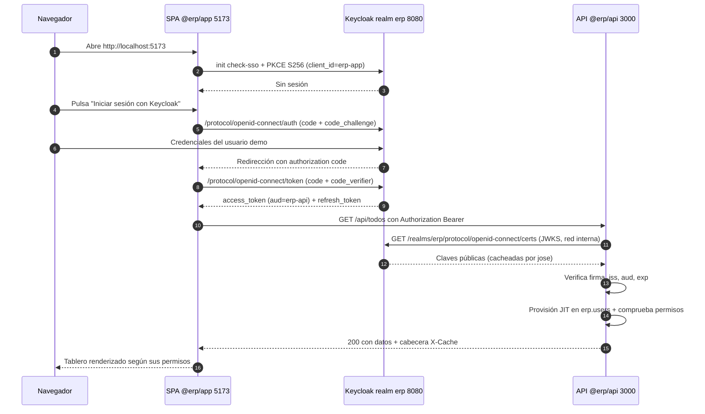
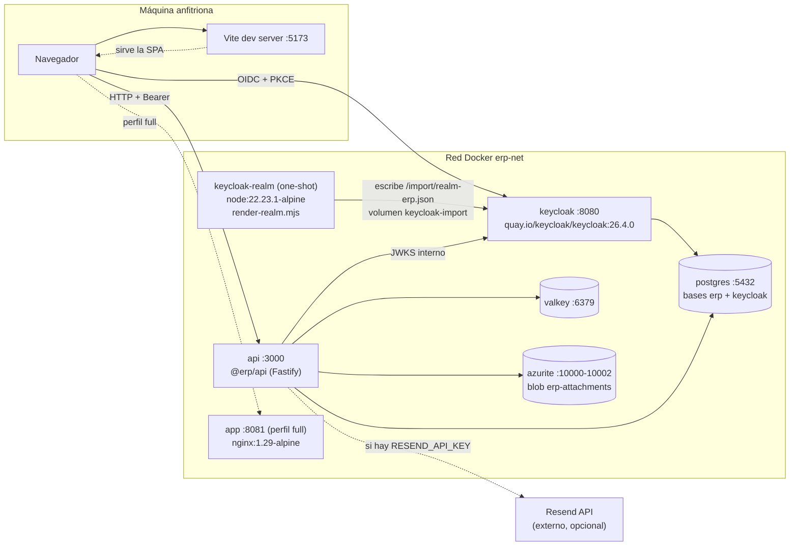

# ERP Demo con Keycloak

Demo **funcional y reproducible** de un mini-ERP (gestión de tareas / *todos*) cuyo control de
acceso vive completo en **Keycloak**: la aplicación no guarda contraseñas, no define usuarios y
no decide roles. Solo lee los permisos que vienen firmados dentro del *access token*.

Todo el stack se levanta con `docker compose` y queda igual en cualquier máquina: versiones
fijadas, imágenes con tag exacto, realm importado de forma declarativa y migraciones de base de
datos versionadas con checksum.

## Qué demuestra

- **OIDC + PKCE `S256`** desde una SPA de React contra un cliente público (`erp-app`).
- **Separación entre roles de negocio y permisos técnicos**: los roles de realm
  (`erp-user`, `erp-manager`, `erp-admin`) son *compuestos* y arrastran *client roles* de
  `erp-api` que actúan como permisos finos (`todos:read`, `todos:delete`, `admin:manage`, …).
  Añadir un permiso no obliga a reasignar usuarios.
- **Validación de token en el backend sin librería de Keycloak**: `jose` + JWKS remoto,
  comprobando `iss` y `aud`.
- **Autorización real en el servidor** (`requirePermissions`) y **autorización cosmética en el
  cliente** (`<Can perm="…">`): la UI oculta, la API prohíbe.
- **Reglas de visibilidad por datos**: sin `todos:read:all` solo ves lo tuyo o lo que te han
  asignado; con ese permiso ves todo.
- **Provisión JIT de usuarios**: la primera petición autenticada crea/actualiza la fila en
  `erp.users` usando el `sub` del token como clave primaria.
- Infraestructura de apoyo: **PostgreSQL 17**, **Valkey** (caché con invalidación por versión),
  **Azurite** (adjuntos en blob storage) y **Resend** (correo, con modo *dry-run*).

Documentación detallada:

- [`docs/arquitectura.md`](docs/arquitectura.md) — monorepo, componentes, base de datos, caché y almacenamiento.
- [`docs/autenticacion.md`](docs/autenticacion.md) — roles, permisos, contenido del token y cómo añadir un permiso nuevo.
- [`docs/operacion.md`](docs/operacion.md) — comandos del día a día, inspección y resolución de problemas.

---

## Requisitos previos

| Herramienta | Versión exigida | Comprobación |
|---|---|---|
| Node.js | **22.23.1** (fijada en `.node-version`) | `node -v` |
| pnpm | **11.9.0** (fijada en `packageManager`) | `pnpm -v` |
| Docker Engine | 24+ con **Compose v2** (subcomando `docker compose`, no `docker-compose`) | `docker compose version` |
| GNU Make | opcional, solo para los atajos `make …` | `make -v` |

Si usas un gestor de versiones (`fnm`, `nvm`, `asdf`, `mise`), `.node-version` selecciona
Node automáticamente. Para pnpm basta con `corepack enable && corepack prepare pnpm@11.9.0 --activate`.

Puertos que deben estar libres en el host: **5432, 6379, 8080, 3000, 5173, 10000, 10001, 10002**
(y **8081** si levantas el perfil `full`).

---

## Arranque rápido

```bash
# 1. Situarse en la raíz del repositorio
cd /home/mapineda48/Repo/mapineda48/KeyCloak-Demo

# 2. Crear el .env local a partir del ejemplo versionado
cp .env.example .env

# 3. Instalar dependencias del monorepo (usa el lockfile)
pnpm install

# 4. Levantar la infraestructura y la API (construye las imágenes propias)
docker compose up -d --build

# 5. Esperar a que Keycloak esté sano y el realm 'erp' importado
until curl -sf http://localhost:8080/realms/erp/.well-known/openid-configuration >/dev/null; do
  echo "esperando a Keycloak…"; sleep 2
done
echo "Keycloak listo"

# 6. Arrancar la SPA en modo desarrollo
pnpm --filter @erp/app dev
```

7. Abre **<http://localhost:5173>** e inicia sesión con cualquiera de los
   [usuarios demo](#usuarios-demo).

Comprobación rápida de que el backend está entero:

```bash
curl -s http://localhost:3000/health/ready | jq
# { "status": "ok", "checks": { "database": …, "cache": …, "storage": …, "mailer": … } }
```

> **Nota:** el paso 4 tarda la primera vez (descarga de imágenes + build de la API). El servicio
> `api` depende de `postgres`, `valkey`, `azurite` y `keycloak` con `condition: service_healthy`,
> así que si `docker compose ps` muestra `api` arriba, todo lo demás ya está sano.

### Variante "todo en contenedores"

Para servir también la SPA compilada detrás de nginx (puerto **8081**), usa el perfil `full`:

```bash
docker compose --profile full up -d --build
# equivalente: pnpm run up:full   /   make up-full
```

En ese modo la configuración del frontend no viaja en el bundle: nginx genera `config.js` con
`window.__ERP_CONFIG__` en el arranque a partir de las variables de entorno.

---

## Servicios y URLs

| Servicio | URL / dirección | Para qué |
|---|---|---|
| Keycloak | <http://localhost:8080> | Emisor OIDC del realm `erp` |
| Consola de administración de Keycloak | <http://localhost:8080/admin> | Usuario/contraseña = `KC_BOOTSTRAP_ADMIN_USERNAME` / `KC_BOOTSTRAP_ADMIN_PASSWORD` del `.env` |
| Metadatos OIDC del realm | <http://localhost:8080/realms/erp/.well-known/openid-configuration> | Endpoints y JWKS |
| API (`@erp/api`) | <http://localhost:3000> | REST bajo `/api`, salud en `/health` y `/health/ready` |
| Swagger UI | <http://localhost:3000/docs> | Documentación viva de todos los endpoints |
| SPA en desarrollo (Vite) | <http://localhost:5173> | `pnpm --filter @erp/app dev` |
| SPA compilada (nginx, perfil `full`) | <http://localhost:8081> | Solo con `--profile full` |
| PostgreSQL | `localhost:5432` | Bases `erp` (aplicación) y `keycloak` (identidad) |
| Valkey | `localhost:6379` | Caché de listados de todos |
| Azurite — Blob | `http://localhost:10000/devstoreaccount1` | Contenedor `erp-attachments` |
| Azurite — Queue | `localhost:10001` | No se usa, se expone por completitud |
| Azurite — Table | `localhost:10002` | No se usa, se expone por completitud |

---

## Usuarios demo

Los tres usuarios se crean de forma declarativa al importar el realm. **Las contraseñas están en
`.env.example`** (variables `DEMO_ADMIN_PASSWORD`, `DEMO_MANAGER_PASSWORD`,
`DEMO_USER_PASSWORD`); no se reproducen aquí a propósito, para que el único sitio donde vivan
sea el fichero de entorno.

| Usuario | Rol de realm | Permisos efectivos (client roles de `erp-api`) | Qué puede hacer en la demo |
|---|---|---|---|
| `worker` | `erp-user` | `todos:read`, `todos:write` | Ver y editar **solo sus** tareas y las asignadas a él. Crear, subir adjuntos, enviar correo. **No** puede borrar ni usar `scope=all`. |
| `manager` | `erp-manager` | `erp-user` + `todos:read:all`, `todos:delete`, `users:read` | Todo lo anterior + ver **todas** las tareas (`scope=all`), borrarlas y listar usuarios. Sin panel de administración. |
| `admin` | `erp-admin` | `erp-manager` + `admin:manage` | Todo lo anterior + estadísticas y registro de auditoría (`/api/admin/*`) y la sección Admin de la SPA. |

Los tres se crean con `emailVerified: true`, `enabled: true` y contraseña **no temporal** (no
piden cambio en el primer login). El rol por defecto del realm (`default-roles-erp`) incluye
`erp-user`, así que cualquier usuario nuevo nace con permisos básicos.

Emails: `DEMO_*_EMAIL` en `.env.example` (`admin@erp.local`, `manager@erp.local`,
`worker@erp.local`). Son dominios ficticios: sirven para probar el flujo de notificación, no
para recibir correo real.

---

## Flujo de autenticación



Detalle importante: la SPA obtiene el token contra **`http://localhost:8080`** (issuer público),
pero la API descarga el JWKS contra **`http://keycloak:8080`** (issuer interno de la red Docker).
Por eso existen dos variables distintas, `KEYCLOAK_ISSUER` y `KEYCLOAK_INTERNAL_ISSUER`.
Está explicado en [`docs/arquitectura.md`](docs/arquitectura.md#issuer-publico-vs-issuer-interno).

## Topología de servicios



Volúmenes persistentes: `pg-data`, `valkey-data`, `azurite-data`, `keycloak-import`.

---

## Correo con Resend

El envío de correo (`POST /api/todos/:id/notify`) está pensado para funcionar **sin configurar
nada**. La API decide su proveedor al arrancar:

| Situación | `mailer.provider` | Comportamiento |
|---|---|---|
| `RESEND_API_KEY` vacía (valor de `.env.example`) | `dry-run` | Registra el correo completo en el log (`to`, `subject`, cuerpo) y devuelve `{ delivered: false, provider: 'dry-run', reason: … }`. **La petición responde 200; nunca falla.** |
| `RESEND_API_KEY` con valor | `resend` | Envía de verdad y devuelve el `id` del mensaje. |
| `MAIL_ENABLED=false` | `dry-run` | Interruptor manual para silenciar el correo aunque haya clave. |

`GET /health/ready` incluye el estado del *mailer*, de modo que puedes ver en qué modo está sin
mirar los logs.

### Activar el envío real

1. Instala e inicia sesión en la CLI de Resend (requiere una cuenta gratuita).
2. Crea una clave de API para este proyecto:

   ```bash
   resend api-keys create --name erp-demo
   ```

3. Copia el valor devuelto (se muestra **una sola vez**) en `.env`:

   ```dotenv
   RESEND_API_KEY=re_xxxxxxxxxxxxxxxxxxxxxxxx
   ```

4. Comprueba qué dominios tienes verificados:

   ```bash
   resend domains
   ```

   - Si aún no verificas ninguno, deja `MAIL_FROM=ERP Demo <onboarding@resend.dev>`: el dominio
     de pruebas de Resend solo permite enviar **a la dirección con la que te registraste**.
   - Con un dominio propio verificado, cambia `MAIL_FROM` a una dirección de ese dominio, por
     ejemplo `MAIL_FROM=ERP Demo <no-reply@midominio.com>`, y opcionalmente rellena
     `MAIL_REPLY_TO`.

5. Reinicia solo la API para que tome la clave:

   ```bash
   docker compose up -d --force-recreate api
   ```

`RESEND_API_KEY` es el **único secreto real** del proyecto y por eso va vacío en `.env.example`.
`.env` está en `.gitignore`.

---

## Guion de demostración

Sesión de 10 minutos que enseña el modelo de permisos de punta a punta. Usa una ventana privada
del navegador para cada usuario (o cierra sesión entre pasos) porque Keycloak mantiene SSO.

### 1. `worker` — el permiso que falta se nota

1. Entra en <http://localhost:5173> como **`worker`** (contraseña en `.env.example`).
2. El tablero aparece vacío: pulsa **"Crear datos de ejemplo"** (`POST /api/todos/seed-demo`).
3. Observa la cabecera de la aplicación: muestra el rol `erp-user`.
4. **No hay botón de borrar** en ninguna tarjeta: la SPA lo envuelve en `<Can perm="todos:delete">`.
5. El selector de alcance no ofrece **"Todos"**, solo "Mías".
6. Demuestra que la UI no es la que manda — intenta borrar desde la terminal y recibe **403**:

   ```bash
   # Ver docs/autenticacion.md para la función get_token
   curl -i -X DELETE http://localhost:3000/api/todos/<id> \
     -H "Authorization: Bearer $WORKER_TOKEN"
   # HTTP/1.1 403  {"error":{"code":"FORBIDDEN","message":"…","statusCode":403}}
   ```

### 2. `manager` — el alcance "todos"

1. Cierra sesión y entra como **`manager`**.
2. Cambia el filtro de alcance a **"Todos"**: ahora ves también las tareas de `worker`.
   Ese selector llama a `GET /api/todos?scope=all`, que exige `todos:read:all`.
3. Aparece el botón de **borrar** (permiso `todos:delete`). Borra una tarea de `worker`:
   `manager` puede tocar datos que no son suyos, `worker` no.
4. No hay sección **Admin**: le falta `admin:manage`.

### 3. `admin` — panel de administración

1. Entra como **`admin`**.
2. Abre la sección **Admin**: estadísticas (`GET /api/admin/stats`), usuarios
   (`GET /api/admin/users`) y auditoría (`GET /api/admin/audit`).
3. En el registro de auditoría se ven las acciones de los pasos anteriores
   (`todo.created`, `todo.deleted`, …) con el `actor_id` de cada usuario.

### 4. La cabecera `X-Cache`

1. Con cualquier usuario, recarga el listado dos veces: el badge de la interfaz pasa de
   **`MISS`** a **`HIT`**.
2. Desde terminal, con las mismas condiciones:

   ```bash
   curl -si http://localhost:3000/api/todos -H "Authorization: Bearer $TOKEN" | grep -i x-cache
   # X-Cache: MISS   (primera vez)
   # X-Cache: HIT    (dentro de CACHE_TTL_SECONDS = 60 s)
   ```

3. Crea o edita una tarea: la siguiente lectura vuelve a ser **`MISS`**. No se borran claves;
   se incrementa la versión del *namespace* `todos` y las claves viejas caducan solas.

### 5. Adjuntos

1. Abre una tarea y sube un archivo (límite `MAX_UPLOAD_BYTES` = 10 MiB).
2. Descárgalo desde la lista de adjuntos: la API lo sirve desde Azurite con su `content_type`.
3. Comprueba que el blob existe de verdad (ver [`docs/operacion.md`](docs/operacion.md#listar-blobs-de-azurite)).

### 6. Correo

1. Pulsa **"Enviar notificación por correo"** en una tarea.
2. Sin `RESEND_API_KEY`, mira el log y verás el correo renderizado:

   ```bash
   docker compose logs -f api | grep -i mail
   ```

3. Con clave configurada, el correo llega y la respuesta trae el `id` de Resend.

---

## Determinismo y reproducibilidad

Este repositorio está construido para dar **exactamente el mismo resultado** en cualquier
máquina y en cualquier momento:

- **Versiones exactas**: ni `^` ni `~` ni `latest` en ningún `package.json`. Node fijado en
  `.node-version` (22.23.1) y pnpm en `packageManager` (11.9.0), con `engines` que lo verifica.
- **Lockfile**: `pnpm-lock.yaml` se versiona y las imágenes se construyen con
  `--frozen-lockfile`; si el lockfile no cuadra con los `package.json`, el build falla en vez de
  resolver versiones nuevas en silencio.
- **Imágenes con tag exacto**: `postgres:17.6-alpine`, `quay.io/keycloak/keycloak:26.4.0`,
  `valkey/valkey:8.1.3-alpine`, `mcr.microsoft.com/azure-storage/azurite:3.35.0`,
  `node:22.23.1-alpine`, `nginx:1.29-alpine`.
- **Realm declarativo**: la configuración de Keycloak (clientes, roles, composiciones, mappers y
  usuarios demo) vive en `infra/keycloak/realm-erp.template.json` y se importa en el arranque.
  Nada se configura a mano en la consola; si tocas algo por la consola, se pierde con
  `docker compose down -v`. El renderizador falla con código ≠ 0 si queda algún marcador
  `__VARIABLE__` sin sustituir, de forma que un `.env` incompleto se detecta al instante.
- **Migraciones versionadas con checksum**: cada fichero de `packages/api/migrations/` se aplica
  una sola vez, en orden lexicográfico, y su hash se guarda en `erp.schema_migrations`. Si
  alguien edita una migración ya aplicada, el arranque falla en vez de dejar dos bases de datos
  distintas conviviendo.
- **Sin valores generados en build**: nada de timestamps, IDs aleatorios ni descargas sin fijar.
- **Un único `.env`** en la raíz consumido por Compose y por Vite (`envDir` apunta a la raíz),
  para que no existan dos fuentes de verdad de configuración.

---

## Estructura del repositorio

```
.
├── docker-compose.yml          # postgres, keycloak-realm, keycloak, valkey, azurite, api, app
├── Makefile                    # atajos equivalentes a los scripts de package.json
├── .env.example                # plantilla de configuración (sin secretos reales)
├── docs/                       # arquitectura, autenticación y operación
├── infra/
│   ├── keycloak/               # plantilla del realm + renderizador
│   ├── nginx/                  # configuración SPA + inyección de config en runtime
│   └── postgres/               # init de la base de datos de Keycloak
└── packages/
    ├── api/                    # @erp/api — Fastify 5, ESM estricto, migraciones SQL
    └── app/                    # @erp/app — React 19 + Vite 7 + keycloak-js
```

## Comandos más usados

| Comando | Equivalente `make` | Qué hace |
|---|---|---|
| `pnpm run up` | `make up` | `docker compose up -d --build` |
| `pnpm run up:full` | `make up-full` | Igual, con el perfil `full` (SPA en nginx) |
| `pnpm run down` | `make down` | Para el stack, conserva los datos |
| `pnpm run reset` | `make reset` | `docker compose down -v` — borra volúmenes y reimporta el realm |
| `pnpm run logs` | `make logs` | Sigue los logs de todos los servicios |
| `pnpm run ps` | `make ps` | Estado y salud de los contenedores |
| `pnpm dev` | `make dev` | Arranca API y SPA en paralelo, fuera de Docker |
| `pnpm build` | `make build` | Compila ambos paquetes |
| `pnpm typecheck` | `make typecheck` | Comprueba tipos en todo el monorepo |

> Make no admite `:` en los nombres de objetivo, así que el único que cambia de nombre es
> `up:full` → `up-full`.

El resto de operaciones (psql, valkey-cli, blobs, migraciones, problemas frecuentes) está en
[`docs/operacion.md`](docs/operacion.md).
