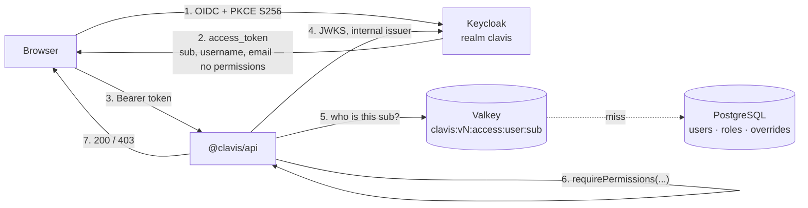
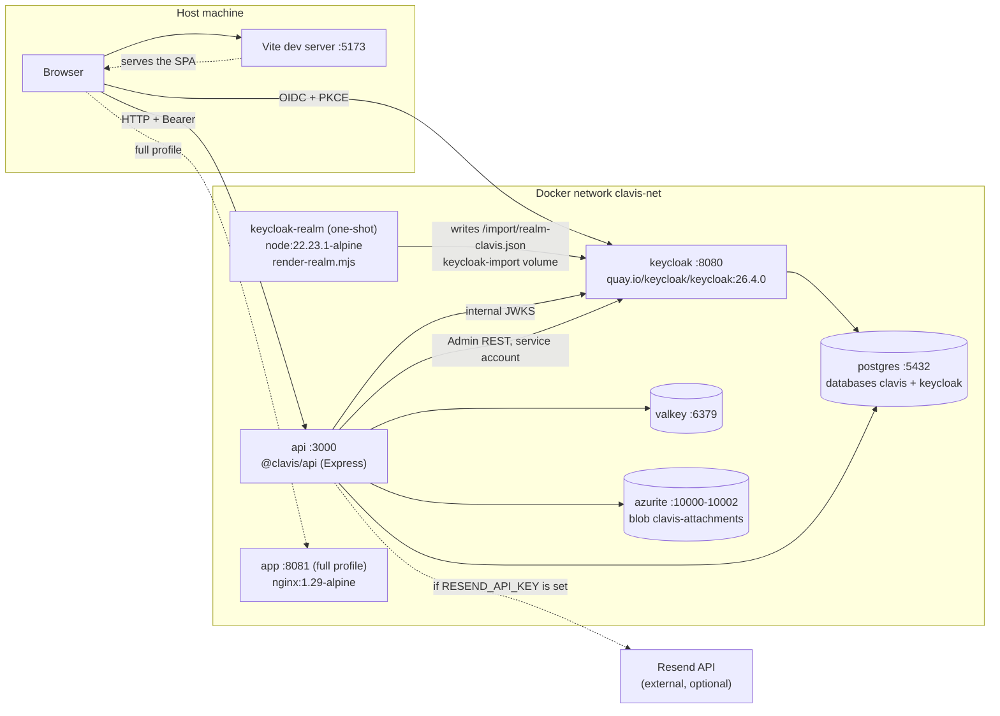

# Clavis

**Clavis** (Latin for *key*) is a **working, reproducible** access-control lab. Keycloak
authenticates: it owns credentials, sessions and password recovery. The application authorises:
it owns users, roles, permissions and per-user exceptions, in its own PostgreSQL schema. The
token proves **who** you are and carries no permissions at all.

The whole stack comes up with `docker compose` and behaves the same on every machine: pinned
versions, images with exact tags, a realm imported declaratively and database migrations
versioned with checksums.

---

> [!WARNING]
> **This is a learning lab, not a production template.**
>
> - The credentials in `.env.example` (`Root123!`, `admin_dev_password`, `clavis_dev_password`,
>   `clavis_api_dev_secret`…) are **local development values in plain sight for everyone**.
>   Never reuse them.
> - The realm uses `sslRequired: "none"` and Keycloak runs in `start-dev`: no HTTPS, the admin
>   console wide open on `localhost:8080`, and no theme cache.
> - `bruteForceProtected` is off and sessions are long, so a demo never gets interrupted.
> - The only real secret in the project is `RESEND_API_KEY`, and it lives only in `.env`, which
>   is in `.gitignore` and **has never been committed**.
>
> To take anything from here into a real environment: HTTPS enforced, `start` instead of
> `start-dev`, brute-force protection, secrets in a secret manager and rotated credentials.

## What it demonstrates

- **Authentication by Keycloak, authorization by the application.** OIDC + PKCE `S256` from a
  React SPA against a public client (`clavis-app`), and a token that is an identity document —
  no roles, no permissions, nothing to keep in sync with the product.
- **A permission model that lives in the database.** Roles are sets of permission keys,
  per-user `grant` / `revoke` exceptions sit on top, and `revoke` wins. A change applies **on
  the very next request**: no token refresh, no sign-out.
- **The catalog is code.** `PERMISSION_DEFS` in `@clavis/shared` is the single source of truth
  for which permission keys exist; the API syncs it into the database at boot and both packages
  import the same `PermissionKey` union, so a typo is a compile error.
- **The full user lifecycle, driven from the application.** A user is created from the Users
  screen: the API registers them in Keycloak first (through the API client's service account),
  keeps the id Keycloak assigns as its own primary key, and offers either a temporary password
  or an emailed invitation.
- **Permission-driven navigation.** One `NAV_ITEMS` manifest feeds both the sidebar and the
  route guards, so a user without a permission does not see a disabled link — they see a
  shorter menu, and the direct URL redirects too.
- **Token validation without a Keycloak library**: `jose` + remote JWKS, checking `iss`, `aud`
  and `exp`.
- **Custom Freemarker login theme**, inheriting from `base` with no external dependencies
  ([detail](#custom-login-theme)).
- **Complete "I forgot my password" flow**, sent by Keycloak over SMTP, with the screens **and
  the email** styled by that same theme ([detail](#password-reset-i-forgot-my-password)).
- **English and Spanish on both front ends**, English by default ([detail](#interface-language)).
- Supporting infrastructure: **PostgreSQL 17**, **Valkey** (access contexts cached by namespace
  version), **Azurite** (blob storage, wired and health-checked) and **Resend** (email, with a
  *dry-run* mode).

Detailed documentation:

- [`docs/access-control.md`](docs/access-control.md) — **the source of truth**: the permission
  model, the data model, and how to add a permission end to end.
- [`docs/authentication.md`](docs/authentication.md) — what Keycloak does: clients, the OIDC
  flow, token validation, first login and password reset.
- [`docs/architecture.md`](docs/architecture.md) — monorepo, components, database, cache and
  storage.
- [`docs/operations.md`](docs/operations.md) — day-to-day commands, inspection and
  troubleshooting.
- [`docs/deployment.md`](docs/deployment.md) — how the lab runs on a real host, and every trap
  that cost a failure getting there.

---

## Prerequisites

| Tool | Required version | How to check |
|---|---|---|
| Node.js | **22.23.1** (pinned in `.node-version`) | `node -v` |
| pnpm | **11.9.0** (pinned in `packageManager`) | `pnpm -v` |
| Docker Engine | 24+ with **Compose v2** (the `docker compose` subcommand, not `docker-compose`) | `docker compose version` |
| GNU Make | optional, only for the `make …` shortcuts | `make -v` |

If you use a version manager (`fnm`, `nvm`, `asdf`, `mise`), `.node-version` selects Node for you.
For pnpm, `corepack enable && corepack prepare pnpm@11.9.0 --activate` is enough.

Ports that must be free on the host: **5432, 6379, 8080, 3000, 5173, 10000, 10001, 10002**
(plus **8081** if you bring up the `full` profile).

---

## Quick start

```bash
# 1. Move to the repository root
cd /path/to/clavis

# 2. Create your local .env from the versioned example
cp .env.example .env

# 3. Install the monorepo dependencies (uses the lockfile)
pnpm install

# 4. Bring up the infrastructure and the API (builds the project's own images)
docker compose up -d --build

# 5. Wait until Keycloak is healthy and the 'clavis' realm has been imported
until curl -sf http://localhost:8080/realms/clavis/.well-known/openid-configuration >/dev/null; do
  echo "waiting for Keycloak…"; sleep 2
done
echo "Keycloak ready"

# 6. Start the SPA in development mode
pnpm --filter @clavis/app dev
```

7. Open **<http://localhost:5173>** and sign in as [root](#the-root-account).

Quick check that the backend is complete:

```bash
curl -s http://localhost:3000/api/health/ready | jq
# { "status": "ok", "checks": { "database": …, "cache": …, "storage": …, "mailer": … } }
```

> **Note:** step 4 is slow the first time (image downloads + API build). The `api` service depends
> on `postgres`, `valkey`, `azurite` and `keycloak` with `condition: service_healthy`, so if
> `docker compose ps` shows `api` up, everything else is already healthy.

### The "everything in containers" variant

To also serve the compiled SPA behind nginx (port **8081**), use the `full` profile:

```bash
docker compose --profile full up -d --build
# equivalent: pnpm run up:full   /   make up-full
```

In that mode the frontend configuration does not travel inside the bundle: nginx generates
`config.js` with `window.__CLAVIS_CONFIG__` at startup from the environment variables.

---

## Services and URLs

| Service | URL / address | What for |
|---|---|---|
| Keycloak | <http://localhost:8080> | OIDC issuer of the `clavis` realm |
| Keycloak admin console | <http://localhost:8080/admin> | Username/password = `KC_BOOTSTRAP_ADMIN_USERNAME` / `KC_BOOTSTRAP_ADMIN_PASSWORD` from `.env` |
| Realm OIDC metadata | <http://localhost:8080/realms/clavis/.well-known/openid-configuration> | Endpoints and JWKS |
| API (`@clavis/api`) | <http://localhost:3000> | REST under `/api`, health on `/api/health` and `/api/health/ready` |
| Swagger UI | <http://localhost:3000/api/docs> | Living documentation of every endpoint |
| SPA in development (Vite) | <http://localhost:5173> | `pnpm --filter @clavis/app dev` |
| Compiled SPA (nginx, `full` profile) | <http://localhost:8081> | Only with `--profile full` |
| PostgreSQL | `localhost:5432` | Databases `clavis` (application) and `keycloak` (identity) |
| Valkey | `localhost:6379` | Cache of resolved access contexts |
| Azurite — Blob | `http://localhost:10000/devstoreaccount1` | Container `clavis-attachments` |
| Azurite — Queue | `localhost:10001` | Unused, exposed for completeness |
| Azurite — Table | `localhost:10002` | Unused, exposed for completeness |

---

<a id="the-root-account"></a>

## The root account

A fresh stack has **exactly one account**: `root`. Nothing is pre-seeded and the realm imports no
people at all — everybody else is created from inside the application.

Root is seeded by the API at boot, from `.env`:

| Variable | Default in `.env.example` | What it sets |
|---|---|---|
| `ROOT_USERNAME` | `root` | The Keycloak username |
| `ROOT_EMAIL` | `root@clavis.local` | Its email. **Change it to a real address** to exercise password reset |
| `ROOT_PASSWORD` | `Root123!` | Re-applied on every boot, non-temporary |
| `ROOT_DISPLAY_NAME` | `Root` | The display name |

The password is deliberately **not repeated here**: `.env` stays the only place it lives.

Root is a **column** in the database (`clavis.users.is_root`), not a role. It bypasses every
permission check, reports the full catalog as its effective permissions, and is refused by every
route that would edit it (`403 ROOT_IMMUTABLE`). It is break-glass: the account that creates the
first real users and grants them the first roles. The reasoning is in
[`docs/access-control.md`](docs/access-control.md#root).

---

<a id="who-decides-what"></a>

## Two questions, two systems



| Question | Answered by | Where the answer lives |
|---|---|---|
| **Who are you?** | Keycloak | The signed token: `sub`, `preferred_username`, `email` |
| **What may you do?** | The application | `clavis.users`, `clavis.roles`, `clavis.user_permission_overrides` |

The effective permissions of a user are `union(role permissions) ∪ grants − revokes`, with
`is_root` short-circuiting to the whole catalog. They are resolved on **every request**, cached
in Valkey under a versioned key, and every mutation that could change them bumps that version —
which is what makes a permission change visible on the next call rather than after the next
sign-in.

An important detail of the wiring: the SPA gets its token from **`http://localhost:8080`**
(public issuer), while the API downloads the JWKS from **`http://keycloak:8080`** (internal
issuer on the Docker network). That is why there are two variables, `KEYCLOAK_ISSUER` and
`KEYCLOAK_INTERNAL_ISSUER`, explained in
[`docs/architecture.md`](docs/architecture.md#6-public-issuer-vs-internal-issuer).

Full model in [`docs/access-control.md`](docs/access-control.md).

---

## Custom login theme

The sign-in screen is **not the one Keycloak ships**: the `clavis` realm uses its own Freemarker
theme called **`clavis`**, hand-written and free of external dependencies (no CDNs, no remote
fonts, no JavaScript of its own).

### What you see

A **split screen**:

- **Left** — branding panel with a gradient: inline SVG logo, the *Clavis* title, a tagline and
  three bullet points about the access model.
- **Right** — the card with the sign-in form, vertically centred.

Below 900 px it collapses into a single column, with the branding panel shrinking to a header.
There is a light and a dark theme via `prefers-color-scheme`, and an **English/Spanish** language
selector, because the realm is imported with `internationalizationEnabled: true`,
`supportedLocales: ["en", "es"]` and `defaultLocale: "en"`.

> **The theme contains no credentials and no hints.** There are no demo accounts to advertise:
> the only account on a fresh stack is root, and its password lives in `.env` alone.

To see it without going through the SPA, open <http://localhost:8080/realms/clavis/account> in a
private window: the realm's account console demands a sign-in and uses this very theme.

### Where it lives

```
infra/keycloak/themes/clavis/
├── theme.properties            # types=login,email
├── email/                      # password reset email (HTML + text) and its messages
└── login/
    ├── theme.properties        # parent=base, styles, locales and kc* class mapping
    ├── template.ftl            # split-screen layout (registrationLayout macro)
    ├── login.ftl               # sign-in form
    ├── footer.ftl  error.ftl  info.ftl
    ├── login-page-expired.ftl  logout-confirm.ftl
    ├── login-reset-password.ftl  login-update-password.ftl
    ├── messages/               # messages_en.properties + messages_es.properties
    └── resources/css/clavis-login.css
```

The directory is mounted into the container from `docker-compose.yml`:

```yaml
volumes:
  - ./infra/keycloak/themes:/opt/keycloak/themes:ro
```

Mounting on top of `/opt/keycloak/themes` is safe: in the official image that directory
**contains nothing but a README**. The built-in themes (`base`, `keycloak`, `keycloak.v2`) travel
inside the server JARs, so the mount hides nothing.

### What it inherits from `base`

`login/theme.properties` starts with `parent=base`, so the theme **only overrides** the templates
listed above. Everything else is still served by Keycloak's `base` theme:

- The pages we do not touch (OTP, update password, verify email, select authenticator…) still
  look like the rest of Clavis thanks to the **property mapping**
  (`kcInputClass=clavis-input`, `kcButtonClass=clavis-btn`, `kcAlertClass=clavis-alert`, …)
  declared in `login/theme.properties`.
- The server's own JavaScript resources (`authChecker.js` to detect a session started in another
  tab, `menu-button-links.js`, `passwordVisibility.js`) are resolved through the inheritance
  chain: `${url.resourcesPath}/js/…` still points at the `base` theme's files.
- Untranslated texts fall back to the `messages_*.properties` of `base`.

The realm applies the theme with `"loginTheme": "__KEYCLOAK_LOGIN_THEME__"` in
`infra/keycloak/realm-clavis.template.json`; `render-realm.mjs` replaces that placeholder with the
value of `KEYCLOAK_LOGIN_THEME` (`clavis` by default).

### How to iterate

Keycloak runs with `start-dev`, and in that mode **themes are not cached**, so the loop is short:

| What you change | What it takes |
|---|---|
| A `.ftl` or `resources/css/clavis-login.css` | **Nothing**: save and reload the browser (`Ctrl+Shift+R` to skip the browser cache) |
| Either of the two `theme.properties` | `docker compose restart keycloak` |
| Adding a new file or directory to the theme | `docker compose restart keycloak` |
| The value of `KEYCLOAK_LOGIN_THEME` | Re-import the realm (`pnpm run reset && pnpm run up`) or apply it live with `kcadm.sh` — see [`docs/operations.md`](docs/operations.md#8-login-theme) |

Check that the mount reached the container:

```bash
docker compose exec keycloak ls /opt/keycloak/themes/clavis/login
```

### Going back to the default theme

Change the variable in `.env` and re-import:

```dotenv
KEYCLOAK_LOGIN_THEME=keycloak      # or keycloak.v2; clavis to come back to the custom one
```

```bash
pnpm run reset && pnpm run up
```

An **already imported** realm does not change its theme just because you edited the template:
Keycloak only imports a realm that does not exist yet. If you do not want to lose your data,
apply it live with `kcadm.sh` following
[`docs/operations.md`](docs/operations.md#8-login-theme).

---

## Interface language

Both front ends speak **English and Spanish**, and **English is the default**.

- **SPA** — the language selector sits in the application header, next to the user menu, and is
  reachable by keyboard. The catalogues are a small hand-written module in
  `packages/app/src/i18n/` (no i18n dependency): `en.ts` is the source of truth and `es.ts` is
  typed against it, so a missing or leftover key breaks the type check instead of showing up in
  production as an untranslated string.
- **Login theme** — the same two languages, from `messages_en.properties` and
  `messages_es.properties`, with the realm imported as `defaultLocale: "en"`.

The SPA picks the initial language from `?lang=`, then `localStorage['clavis.locale']`, then the
browser language, and it hands the current one to Keycloak when you sign in or out
(`keycloak.login({ locale })` → `ui_locales`), so the login screen shows up in the language you
were already reading.

---

## Service topology



Persistent volumes: `pg-data`, `valkey-data`, `azurite-data`, `keycloak-import`.

---

## Email with Resend

The API picks its provider at startup and works **without configuring anything**:

| Situation | `mailer.provider` | Behaviour |
|---|---|---|
| `RESEND_API_KEY` empty (the `.env.example` value) | `dry-run` | Logs the whole message (`to`, `subject`, body) instead of sending it. Requests still answer normally. |
| `RESEND_API_KEY` set | `resend` | Really sends it and returns the message `id`. |
| `MAIL_ENABLED=false` | `dry-run` | Manual switch to silence email even when a key is present. |

`GET /api/health/ready` reports the *mailer* status, so you can tell which mode you are in without
reading the logs. It is **not** a critical check: email being unavailable never makes the service
unready.

### Turning on real delivery

1. Install the Resend CLI and log in (a free account is enough).
2. Create an API key for this project:

   ```bash
   resend api-keys create --name clavis
   ```

3. Copy the returned value (it is shown **only once**) into `.env`:

   ```dotenv
   RESEND_API_KEY=re_xxxxxxxxxxxxxxxxxxxxxxxx
   ```

4. Check which domains you have verified:

   ```bash
   resend domains
   ```

   - If you have not verified any yet, leave `MAIL_FROM=Clavis <onboarding@resend.dev>`:
     Resend's test domain can only send **to the address you signed up with**.
   - With a verified domain of your own, point `MAIL_FROM` at an address on that domain, for
     example `MAIL_FROM=Clavis <no-reply@mydomain.com>`, and optionally fill in
     `MAIL_REPLY_TO`.

5. Restart only the API so it picks up the key:

   ```bash
   docker compose up -d --force-recreate api
   ```

`RESEND_API_KEY` is the **only real secret** in the project, which is why it ships empty in
`.env.example`. `.env` is in `.gitignore`.

---

## Password reset ("I forgot my password")

There is one thing worth getting straight before touching anything: **there are two different
email paths**, not one.

| Who sends | How | What it sends |
|---|---|---|
| The API (`@clavis/api`) | Resend's **HTTP** API (`resend` SDK) | Application email |
| **Keycloak** | **SMTP** | Password reset, invitations, email verification |

Keycloak cannot talk to Resend's HTTP API: it only sends over SMTP. That is why the realm
configures Resend's SMTP relay (`smtp.resend.com:587`, STARTTLS) and `docker-compose.yml` reuses
**the same** `RESEND_API_KEY` as the SMTP password, so you only have one secret to look after:

```yaml
KEYCLOAK_SMTP_USER: ${KEYCLOAK_SMTP_USER:-resend}
KEYCLOAK_SMTP_PASSWORD: ${RESEND_API_KEY:-not-configured}
```

That same path carries the **invitations** the Users screen sends: an *execute-actions* email
with a link to choose a password.

### What it takes to work

1. `RESEND_API_KEY` set in `.env`.
2. `KEYCLOAK_SMTP_FROM` with an address on a **verified domain** in Resend (`resend domains`
   tells you). With the `onboarding@resend.dev` test domain you can only write to the address you
   signed up with.
3. The user needs a **real email address**. `root@clavis.local` from `.env.example` receives
   nothing: change `ROOT_EMAIL` in your `.env` to an address of yours before trying it.

### The walkthrough

1. On the login screen, the **"Forgot your password?"** link (it shows up because the realm has
   `resetPasswordAllowed: true`).
2. A form asking for username or email → Keycloak sends the message.
3. The email arrives styled by the `clavis` theme, with an action button.
4. The link opens the **new password** screen (with confirmation and the option to sign out from
   the other devices).
5. Once saved, the session carries on into the application.

The three screens and the email all use the custom theme: they live in
`infra/keycloak/themes/clavis/login/login-reset-password.ftl`,
`.../login-update-password.ftl` and `infra/keycloak/themes/clavis/email/`.

> The realm only reads `smtpServer`, `resetPasswordAllowed` and `emailTheme` **when it is
> imported**. If your realm already exists, apply them live with `kcadm.sh` (see
> [`docs/operations.md`](docs/operations.md#10-password-reset-and-keycloak-email)) or recreate the stack with
> `pnpm run reset`.

---

## Demo script

Ten minutes that walk the access model end to end. Use a private browser window for the second
user (or sign out between steps), because Keycloak keeps the SSO session.

### 1. `root` — the only door on a fresh stack

1. Go to <http://localhost:5173> and sign in as **`root`** (password in `.env`).
2. **Home** shows the username, a `root` chip instead of roles, and a note that root holds every
   permission. The sidebar shows all four sections.
3. Look at the token if you want the point driven home — it mentions none of that:

   ```bash
   # see docs/authentication.md for the get_token helper
   echo "$ROOT_TOKEN" | jq -R 'split(".")[1] | @base64d | fromjson' | jq '.realm_access, .resource_access'
   ```

   The permissions come from the database, not the JWT.

### 2. Create a user with a temporary password

1. Open **Users** → *Create user*.
2. Fill in an email and a display name, choose **temporary password**, and set one.
3. The row appears immediately. Behind it: the API registered the account in Keycloak through the
   API client's service account, kept the id Keycloak assigned as its own primary key, and
   inserted the application row in a transaction.

### 3. The new session is forced to change the password

1. In a private window, sign in as the new user.
2. Keycloak intercepts with the **update password** screen — the `UPDATE_PASSWORD` required
   action that comes with a temporary credential. Choose a new one.
3. You land in the application. **Only Home is in the sidebar**: the user has no roles and no
   exceptions, so `NAV_ITEMS` renders one entry.
4. Try a direct URL — <http://localhost:5173/admin/users> — and the route guard redirects to the
   forbidden view. Try the API and it is a real `403`:

   ```bash
   curl -s -o /dev/null -w '%{http_code}\n' http://localhost:3000/api/users \
     -H "Authorization: Bearer $NEW_USER_TOKEN"
   # 403
   ```

### 4. Grant an exception and watch the navigation change

1. Back in the root window, open **Access** → the per-user tab, and select the new user. (Root is
   not in that list — it has nothing to grant.)
2. Set `users:read` to **grant**. It applies as soon as you choose it; the third column shows the
   resulting effective value.
3. In the other window, reload. **Users has appeared in the sidebar** — with the same token, no
   sign-out, no token refresh. That is the versioned cache being bumped by the write.
4. The same call from the terminal is now a `200`, on the very next request.

### 5. Revoke, and prove that revoke wins

1. Still in root: create a role in **Access** → *Create role*, then tick `users:read` and
   `audit:read` in its column of the catalog matrix. Assign it to the user from the Users screen.
2. Both sections appear for them.
3. Now set a `revoke` exception on `audit:read` for that user. Audit disappears again: the
   exception is applied after the union, so it beats the role.

### 6. Disable, delete, and the audit trail

1. Disable the user from the Users screen. Their next request is `403 ACCOUNT_DISABLED` — the
   application refuses them even though Keycloak would still authenticate the identity.
2. Re-enable, then delete. The Keycloak account goes with the row.
3. Open **Audit**: every step above is there — `user.created`, `access.overrides_replaced`,
   `role.created`, `user.updated`, `user.deleted` — with the actor's id.

### 7. Everything above, from the outside

```bash
./scripts/verify-api.sh
```

The same walk in 99 assertions, no browser involved. See [Verification](#verification).

---

## Determinism and reproducibility

This repository is built to produce **exactly the same result** on any machine and at any time:

- **Exact versions**: no `^`, no `~`, no `latest` in any `package.json`. Node pinned in
  `.node-version` (22.23.1) and pnpm in `packageManager` (11.9.0), with `engines` enforcing it.
- **Lockfile**: `pnpm-lock.yaml` is committed and the images are built with `--frozen-lockfile`;
  if the lockfile does not match the `package.json` files, the build fails instead of quietly
  resolving new versions.
- **Images with exact tags**: `postgres:17.6-alpine`, `quay.io/keycloak/keycloak:26.4.0`,
  `valkey/valkey:8.1.3-alpine`, `mcr.microsoft.com/azure-storage/azurite:3.35.0`,
  `node:22.23.1-alpine`, `nginx:1.29-alpine`.
- **Declarative realm**: the Keycloak configuration (clients, the service account, the user
  profile, SMTP and the themes) lives in `infra/keycloak/realm-clavis.template.json` and is
  imported at startup. Nothing is configured by hand in the console; if you change something
  there, it is gone after `pnpm run reset`. The renderer exits with a non-zero code if any
  `__VARIABLE__` placeholder is left unsubstituted, so an incomplete `.env` is caught
  immediately.
- **The permission catalog is code**, not configuration: `PERMISSION_DEFS` in `@clavis/shared`,
  synced into the database at boot. Two environments cannot disagree about which permissions
  exist.
- **Migrations versioned with checksums**: every file in `packages/api/migrations/` is applied
  once, in lexicographic order, and its hash is stored in `clavis.schema_migrations`. If somebody
  edits a migration that has already been applied, startup fails instead of leaving two different
  databases living side by side.
- **No values generated at build time**: no timestamps, no random IDs, no unpinned downloads.
- **A single `.env`** at the root, consumed by Compose and by Vite (`envDir` points at the root),
  so there are never two sources of truth for the configuration.

---

## Repository layout

```
.
├── docker-compose.yml          # postgres, keycloak-realm, keycloak, valkey, azurite, api, app
├── Makefile                    # shortcuts equivalent to the package.json scripts
├── .env.example                # configuration template (no real secrets)
├── docs/                       # access-control, authentication, architecture, operations, deployment
├── infra/
│   ├── keycloak/               # realm template + renderer
│   │   └── themes/clavis/      # custom login and email theme (Freemarker + CSS, no dependencies)
│   ├── nginx/                  # SPA config + runtime config injection
│   └── postgres/               # init of the Keycloak database
├── scripts/                    # end-to-end verification suites and deployment helpers
└── packages/
    ├── shared/                 # @clavis/shared — the typed permission catalog, imported by both
    ├── api/                    # @clavis/api — Express 5, strict ESM, SQL migrations
    └── app/                    # @clavis/app — React 19 + Vite 7 + TanStack Router + keycloak-js
```

## Most used commands

| Command | `make` equivalent | What it does |
|---|---|---|
| `pnpm run up` | `make up` | `docker compose up -d --build` |
| `pnpm run up:full` | `make up-full` | The same, with the `full` profile (SPA behind nginx) |
| `pnpm run down` | `make down` | Stops the stack, keeps the data |
| `pnpm run reset` | `make reset` | `docker compose down -v` — drops the volumes and re-imports the realm |
| `pnpm run logs` | `make logs` | Follows the logs of every service |
| `pnpm run ps` | `make ps` | Container status and health |
| `pnpm dev` | `make dev` | Runs API and SPA in parallel, outside Docker |
| `pnpm build` | `make build` | Builds every package |
| `pnpm typecheck` | `make typecheck` | Type-checks the whole monorepo |
| `pnpm test` | `make test` | Unit tests (`node:test`, pure logic, no service needed) |
| `pnpm run verify` | `make verify` | End-to-end verification (API + login theme) |

> Make does not accept `:` in target names, so the only one that changes name is
> `up:full` → `up-full`.

Everything else (psql, valkey-cli, migrations, common problems) is in
[`docs/operations.md`](docs/operations.md).

---

## Verification

The lab ships three suites that run **against the running stack**, not against mocks, because the
layers it is made of break in ways the compiler cannot see:

```bash
pnpm run verify          # API + login theme
pnpm run verify:api      # the access model, end to end
pnpm run verify:theme    # that the Freemarker theme still authenticates
pnpm run verify:reset    # password reset (needs the resend CLI)
```

What they really cover:

- **`verify-api.sh` — 99 assertions that walk the whole permission model from the outside.**
  Root proves the bypass and the full catalog; it then creates a throwaway user through the API
  (which registers it in Keycloak) and shapes that user's access live: the temporary password
  **blocks the grant** until the first-login change, an override `grant` opens a door **on the
  very next request**, the `revoke` closes it — beating the role that grants the same key — a
  role adds exactly what it declares, `disabled` refuses everything, and root plus the system
  role stay immutable. The last two sections cover the guards that sit behind a permission the
  caller does hold: assigning roles needs `access:manage` on create as well as on update, nobody
  edits their own roles, status, overrides or account, and no caller hands out a permission they
  do not hold themselves — including the two escalations that guard was written to close. If
  somebody loosens a `requirePermissions` or forgets a cache bump, this is where it shows.
- **`verify-login-theme.sh` — the whole OIDC flow**: authorization with PKCE `S256` → form →
  *authorization code* → exchange for an *access token*. A custom theme can render perfectly and
  still have lost the form's `id`, and then nobody can sign in.
- **`verify-password-reset.sh` — the reset email for real**: it is requested, **read back through
  the Resend API**, its link is followed, the password is set and then used to sign in.

All three read root's credentials from `.env`. Details of each one in
[`scripts/README.md`](scripts/README.md).

---

## License

[MIT](LICENSE) © Miguel Angel Pineda Vega.

Remember the warning at the top: this is a learning lab. The license lets you reuse it, but the
security configuration in here is **not** fit for production.
