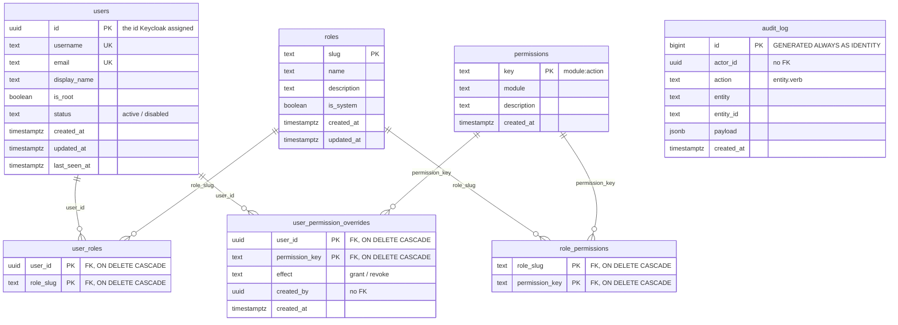
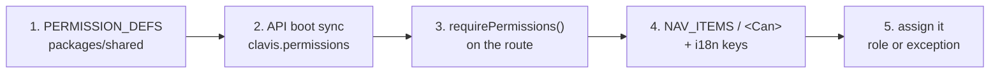
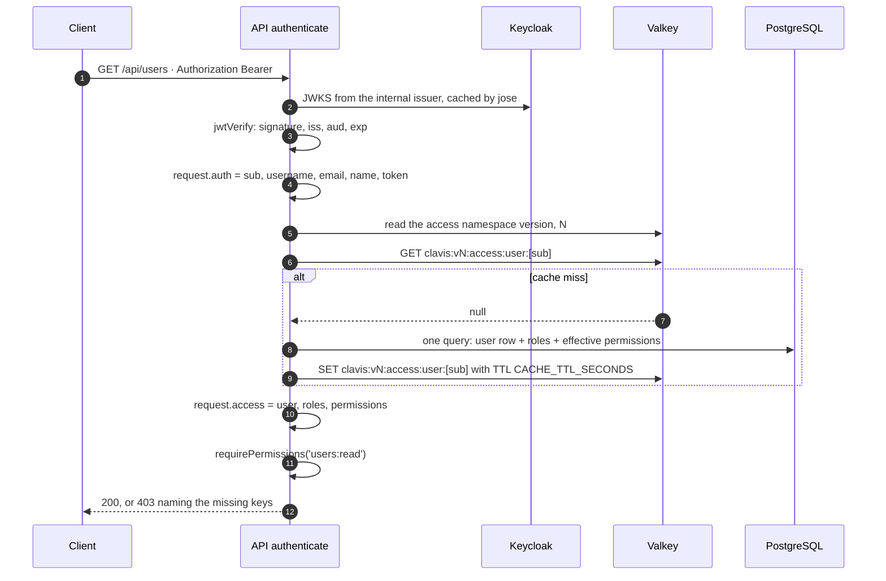
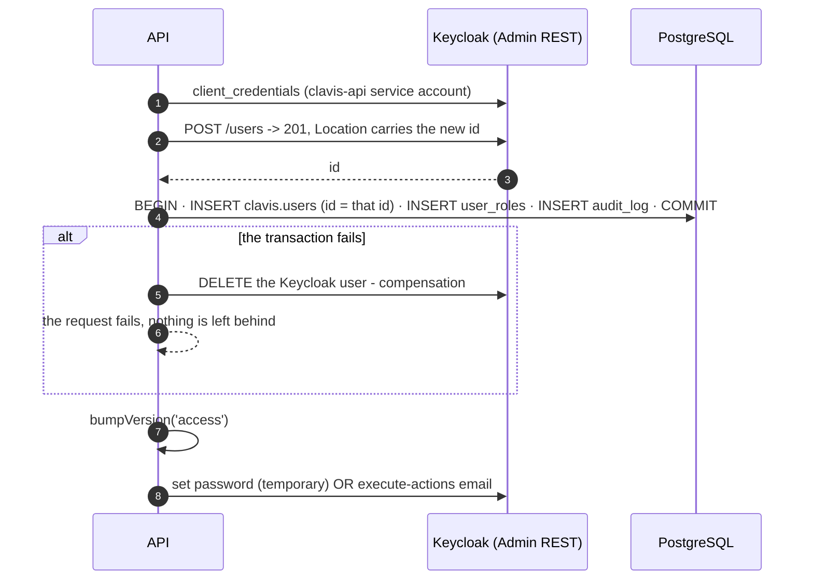

# Access control

What the application is allowed to do, and who decides it. Keycloak is not in this document
beyond the point where it hands over an identity — that half lives in
[`authentication.md`](authentication.md).

Realm: **`clavis`**. Schema: **`clavis`** in the `clavis` database. Permission catalog:
`packages/shared/src/permissions.ts`.

---

<a id="two-questions"></a>

## 1. Two questions, two systems

Every request has to answer two questions, and this lab answers them in two different places.

| Question | Who answers | Where the answer lives |
|---|---|---|
| **Who are you?** | Keycloak | The token: `sub`, `preferred_username`, `email`, `name` |
| **What may you do?** | The application | PostgreSQL: `clavis.users`, `clavis.roles`, `clavis.user_permission_overrides` |

The access token carries **no permissions at all**. It is an identity document, not a
capability list. `GET /api/me` is what returns roles and effective permissions, and it reads
them from the database on every request.

### Why the database decides

The earlier version of this lab put permissions in the token, as composite realm roles pulling
in client roles. It demonstrated the Keycloak mechanism well and it aged badly:

- **A permission change did not apply until the token was refreshed.** Up to
  `accessTokenLifespan` (15 minutes) of a user still holding access somebody had just taken
  away. There is no way to shorten that window without shortening every token.
- **Per-user exceptions had no home.** "This one person also needs to read the audit log" is an
  ordinary request in a business application. Modelling it in Keycloak means either a role per
  person or a direct client-role grant that nothing in the product can show or explain.
- **The permission list was split across two repositories of truth** — the realm JSON and the
  API constant — and they drifted.
- **Business modules evolve faster than identity.** Adding a module means adding permission
  keys, screens and endpoints. It should not mean re-importing a realm.

Moving the decision into the application database is what most products end up doing, and it
buys three concrete things:

1. **Changes apply on the next request.** No token refresh, no sign-out.
2. **Exceptions are first-class**: `grant` and `revoke` rows per user, on top of the roles.
3. **The catalog is code**, so a permission that does not exist cannot be required by a route,
   and a route that requires it cannot be spelled wrong.

Keycloak keeps everything it is genuinely good at: credentials, sessions, password reset,
brute-force policy, MFA if it were ever turned on, and the OIDC contract itself.

---

<a id="data-model"></a>

## 2. The data model



### The effective-permission formula

```
effective(user) = union(permissions of the user's roles)
                ∪ overrides where effect = 'grant'
                − overrides where effect = 'revoke'
```

and, short-circuiting everything above it:

```
effective(user) = the whole catalog,  when users.is_root
```

That is one SQL statement in `packages/api/src/lib/access.ts`
(`UNION` for the grants, `EXCEPT` for the revokes), resolved in a single round trip together
with the user row and their role slugs.

Three consequences worth stating plainly:

- **`revoke` wins.** It is applied after the union, so it beats both a role and an explicit
  `grant`. There is no ordering to reason about and no "most specific rule" heuristic.
- **`(user_id, permission_key)` is the primary key of the override table**, so a user cannot
  hold a `grant` and a `revoke` for the same key. The exception is one value, not a history.
- **Non-root results are filtered against the code catalog** on the way out. A key deleted from
  `PERMISSION_DEFS` cannot leak through a database row that has not been cleaned up yet.

### Modelling decisions

- **`users.id` is the id Keycloak assigned.** No parallel internal id and no mapping table, so
  the `sub` claim indexes the row directly. It is the *only* thing the two systems share.
- **`email` is `NOT NULL UNIQUE`.** The application addresses people by email — that is how an
  invitation reaches them — so an ambiguous address is a data bug, not a tolerated state.
- **`is_root` is a column, not a role.** See [section 7](#root).
- **`status` is `text` with a `CHECK`, not an enum type.** A `CHECK` constraint is altered with
  plain SQL in a migration; a PostgreSQL enum is not.
- **`audit_log.actor_id` and `user_permission_overrides.created_by` carry no foreign key.** The
  record of who did something has to survive the deletion of the person who did it.
- **`updated_at` is maintained by the database** through `clavis.set_updated_at()` and
  `BEFORE UPDATE` triggers on `clavis.users` and `clavis.roles`. On `users` the trigger is
  declared `BEFORE UPDATE OF username, email, display_name, is_root, status`, so the presence
  mark on `last_seen_at` does not move it: `updated_at` answers "when was this record last
  edited", not "when was this person last here".

---

<a id="catalog-in-code"></a>

## 3. The catalog lives in code

`packages/shared/src/permissions.ts` (package `@clavis/shared`) exports `PERMISSION_DEFS`, and
that array is the source of truth for **which permission keys exist**:

| Key | Module | What it allows |
|---|---|---|
| `users:read` | `users` | List and view system users |
| `users:create` | `users` | Create system users |
| `users:update` | `users` | Edit users: status, roles and profile |
| `users:delete` | `users` | Delete system users |
| `access:read` | `access` | View roles, permissions and assignments |
| `access:manage` | `access` | Manage roles and per-user permission overrides |
| `audit:read` | `audit` | Read the audit trail |

The convention is `module:action`, one module per API routes file.

`PermissionKey` is derived from the array (`(typeof PERMISSION_DEFS)[number]['key']`), so it is
a union of string literals rather than `string`. Both packages import it:

- the **API** types `requirePermissions(...keys: PermissionKey[])` with it, so a typo is a
  compile error rather than a route nobody can ever call;
- the **SPA** types `NAV_ITEMS[].required` and `<Can perm=…>` with the very same union, so the
  navigation cannot ask for a permission the server has never heard of.

That is the whole reason `@clavis/shared` exists. It carries no runtime logic beyond the
catalog and two helpers over it.

### The database never invents keys

At boot the API **syncs the catalog into `clavis.permissions`**: it upserts every entry
(`ON CONFLICT (key) DO UPDATE` on `module` and `description`) and then deletes every row whose
key is no longer in the array. Those deletes cascade into `role_permissions` and
`user_permission_overrides`, so removing a permission from the code removes every assignment of
it in the same transaction.

The table is therefore a **projection**, kept so the UI can render descriptions and so the
assignment tables can have real foreign keys. Editing it by hand is pointless: the next boot
overwrites it.

---

<a id="add-a-permission"></a>

## 4. Adding a permission end to end

Example: **`reports:export`**, in a new `reports` module.

### Step 1 — Add it to the catalog

`packages/shared/src/permissions.ts`:

```ts
export const PERMISSION_DEFS = [
  // …
  { key: 'reports:export', module: 'reports', description: 'Export reports' },
] as const satisfies readonly PermissionDef[]
```

Nothing else changes here. `PermissionKey`, `PERMISSION_KEYS` and `PERMISSION_MODULES` are all
derived.

### Step 2 — Restart the API

```bash
docker compose restart api
docker compose logs --tail=30 api | grep -i 'catalog\|access-control'
# … "Permission catalog synced"
# … "Access-control base ready: catalog synced, admin role seeded, root linked"
```

The boot sync inserts the row into `clavis.permissions` and re-seeds the `admin` system role
with the full catalog, so `admin` picks up the new key automatically. **No realm re-import and
no database migration**: the catalog is not schema.

### Step 3 — Require it on the route

```ts
app.get('/reports/export', {
  preHandler: [app.authenticate, app.requirePermissions('reports:export')],
  schema: { tags: ['reports'], security: [{ bearerAuth: [] }], /* … */ },
}, handler)
```

`requirePermissions` is a **logical AND** over everything it receives, and root bypasses it. On
failure it answers `403` with `{ error: { code: 'FORBIDDEN', message, statusCode } }`, naming
the missing keys in the message.

> If you add a new OpenAPI tag, add it to the `tags` array in `packages/api/src/server.ts` too,
> or the documentation grows a second, undescribed section.

### Step 4 — Use it in the SPA

For a whole section, add an entry to the manifest in `packages/app/src/router.tsx` and a route
guard:

```tsx
export const NAV_ITEMS = [
  // …
  { to: '/admin/reports', labelKey: 'nav.reports', required: 'reports:export' },
]

const reportsRoute = createRoute({
  getParentRoute: () => rootRoute,
  path: '/admin/reports',
  beforeLoad: requirePermission('reports:export'),
  component: ReportsPanel,
})
```

For a single control inside an existing screen, `<Can>` is enough:

```tsx
<Can perm="reports:export">
  <button onClick={exportReport}>Export report</button>
</Can>
```

Then add `nav.reports` to `packages/app/src/i18n/en.ts` **first** and mirror it in `es.ts`;
`es.ts` is typed against `en.ts`, so a missing key fails `pnpm typecheck` instead of rendering
as a blank label.

### Step 5 — Grant it to somebody

Sign in as root, open **Access**, and either tick the new cell for a role in the catalog matrix
or record a per-user `grant` in the exceptions editor. From the terminal:

```bash
curl -s -X PUT "http://localhost:3000/api/access/roles/admin/permissions" \
  -H "Authorization: Bearer $ROOT_TOKEN" -H 'Content-Type: application/json' \
  -d '{"permissions":["…","reports:export"]}'
```

…except that `admin` is a system role and the API refuses to edit it (`403 SYSTEM_ROLE`); it
already has the key from step 2. Use a role of your own.

### The route at a glance



What is **not** on that list: the realm template, `docker compose down -v`, a migration, a
manual `INSERT`. If any of those looks necessary, something is being modelled in the wrong
place.

---

<a id="request-resolution"></a>

## 5. How a request is resolved



The two contexts are deliberately separate objects:

| Property | Filled by | Contains |
|---|---|---|
| `request.auth` | The verified token | `sub`, `username`, `email`, `name`, `token` |
| `request.access` | The database | `user` (id, username, email, displayName, isRoot, status), `roles`, `permissions` |

### Two refusals that are not `401`

Authentication succeeded in both cases; there is simply nothing to authorise.

| Situation | Status | Code |
|---|---|---|
| Valid token, no row in `clavis.users` | `403` | `USER_NOT_PROVISIONED` |
| Valid token, `status = 'disabled'` | `403` | `ACCOUNT_DISABLED` |

The first one is the normal state of anyone Keycloak knows and the application does not. There
is **no just-in-time provisioning**: an identity does not become a user by showing up. Users are
created deliberately, from the application ([section 6](#6-user-lifecycle)).

The SPA treats both as a decision rather than an error and renders a blocked screen with a sign-out
button, instead of an empty application.

<a id="cache-bump"></a>

### The versioned cache, and the rule that keeps it honest

Resolved access contexts are cached in Valkey under the **`access` namespace**:

```
clavis:v<version>:access:user:<sub>          TTL = CACHE_TTL_SECONDS (60 s)
```

`<version>` is an integer counter read with `cache.version('access')` and incremented with
`cache.bumpVersion('access')` (a Redis `INCR`, O(1) and atomic). Bumping does not delete
anything: every new key is built with the new version, the old ones are orphaned and expire on
their own.

> **The rule: every mutation that can change somebody's permissions bumps the namespace.**

That is: creating, updating and deleting users, replacing overrides, creating a role, replacing
a role's permissions, deleting a role, and the boot catalog sync.

The observable contract is the point of the whole design: **a permission change applies on the
very next request**, from any client, with the same token. `verify-api.sh` asserts exactly that
— an override is written and the *immediately following* call flips from `403` to `200`.

> **Trap.** Adding a mutating route and forgetting the bump produces a bug that is invisible for
> up to `CACHE_TTL_SECONDS` and then fixes itself, which is the hardest possible shape to
> reproduce.

That is why the seven request mutations do not each remember to do it. They all go through
`mutate()` (`packages/api/src/lib/mutate.ts`), which is the whole convention in one place:

1. open `app.db.tx()`;
2. run the write on that client;
3. insert the `audit_log` row **on the same client**, inside the same transaction;
4. COMMIT;
5. **then** `bumpVersion`.

Each step earns its position. The audit row is inside the transaction because it used to run
after the commit and swallow its own errors, so the trail could silently miss a change that is
permanently in the database — the exact failure an audit trail exists to rule out. They now
commit together or not at all, which means **an `audit_log` insert failure fails the user's
write**: a deliberate trade, since an unaudited privileged write is worse than a failed one.
The bump is after COMMIT because bumping first opens a window in which a concurrent request
repopulates the new version with the pre-commit state — precisely the staleness it exists to
prevent. And `invalidate` is a required field rather than an optional one, so adding a mutation
forces its author to decide rather than forget.

Cache failures degrade to a miss rather than an error: if Valkey is down, every request resolves
from PostgreSQL. Degrading is not guessing, though, and the version is where the difference
matters:

- **`version()` returns `null` when it could not be read**, and `authenticate` then goes straight
  to PostgreSQL and writes nothing back. Answering `1` instead would compose a `v1` key, and a
  surviving `v1` entry can hold permissions that several bumps ago took away.
- **`bumpVersion()` retries once and, if it still fails, returns `null` and logs at `error`.** A
  lost invalidation leaves every derived entry readable until its TTL expires, which is exactly
  the window a revoke is supposed to close.

---

<a id="user-lifecycle"></a>

## 6. User lifecycle

Users are created **from the application**, never by hand in the Keycloak console, and never by
signing in.

### Creation — `POST /api/users` · `users:create`



**Keycloak goes first because it owns the id.** The value it returns in the `Location` header
becomes the primary key of `clavis.users`, which is what makes `sub` a direct index later. If
the database write fails afterwards, the Keycloak user is deleted — a compensating action, since
two systems cannot share one transaction.

### Every two-system write compensates, or explains why it does not

| Route | Order | If the second step fails |
|---|---|---|
| `POST /api/users` | Keycloak creates, then PostgreSQL | The Keycloak user is deleted again |
| `PATCH /api/users/:id` with a `status` change | Keycloak `setEnabled`, then PostgreSQL | `setEnabled` is put back to its previous value, best effort, and the original error is returned |
| `DELETE /api/users/:id` | Keycloak deletes, then PostgreSQL | **Nothing is undone, on purpose.** The handler tolerates a Keycloak `404`, so it is idempotent: the fix is to call `DELETE` again. Do not "fix" it by reordering — deleting the row first would leave an identity that can still authenticate |

A failure that leaves the two systems disagreeing is logged at `error` with a `RECONCILE:`
marker and the user id, because the one thing worse than needing a manual reconciliation is not
knowing that you do.

Two credential modes, chosen with `credentialMode` in the body:

| Mode | What happens | First sign-in |
|---|---|---|
| `temporary_password` | The administrator sets a first password (`temporaryPassword` in the body). Keycloak marks it temporary. | Keycloak forces `UPDATE_PASSWORD` before the session starts |
| `invite` | The user is created with the `UPDATE_PASSWORD` required action and Keycloak emails an *execute-actions* link over the realm SMTP relay (Resend). | The link opens the "set your password" screen |

**A failed invitation does not roll back the user.** Mail is a separate system with its own
failure modes; losing a created user because an SMTP relay was briefly unreachable would be the
worse outcome. The response carries `invite: { sent: false, reason: … }` and the row exists.
`POST /api/users/:id/resend-invite` (`users:update`) retries it.

> Both modes leave the account with a pending required action, so **the password grant is
> refused until the first login is completed** — Keycloak answers "Account is not fully set up".
> That contract is described in
> [`authentication.md`](authentication.md#8-first-login-and-required-actions).

### The rest of the surface

| Route | Permission | Notes |
|---|---|---|
| `GET /api/users` | `users:read` | `limit` 1–500, default 100 |
| `POST /api/users` | `users:create` | 201 `{ user, invite }`; duplicate email → `409 USER_EXISTS`; a non-empty `roles` also needs `access:manage` |
| `PATCH /api/users/:id` | `users:update` | `displayName`, `status`, `roles`; `roles` also needs `access:manage` |
| `DELETE /api/users/:id` | `users:delete` | 204; removes the Keycloak user too |
| `POST /api/users/:id/resend-invite` | `users:update` | 200 `{ invite }` |

### Two rules the route table cannot express

`requirePermissions` is a static preHandler: it sees the token and the resolved access context,
never the body. Two rules therefore live inside the handlers.

- **Assigning roles needs `access:manage`** (`403 ROLE_ASSIGNMENT_DENIED`), on `POST` and on
  `PATCH` alike. `users:create` and `users:update` provision people and edit their profile and
  status; they do not decide who holds which role. Without this the split between `users:*` and
  `access:*` would exist only in the catalog: anyone with `users:update` could `PATCH` themselves
  into the `admin` role — which boot seeding fills with the entire catalog — and hold everything
  on the very next request, because the mutation bumps the cache namespace immediately. `POST`
  is the same door one step further away: create an account carrying `admin`, with a temporary
  password you chose, and sign in as it.
- **Nobody changes their own `roles` or `status`, and nobody deletes themselves**
  (`403 SELF_MODIFICATION`). Self-granting is escalation; self-disabling and self-deleting are
  lockouts. Editing one's own `displayName` carries no privilege and stays allowed.

`users:delete` is its own key rather than a facet of `users:update` for the same reason: an
irreversible operation that also removes the Keycloak identity is not the same authority as
"edit the profile", and a role that should be able to do one and not the other has to be
expressible.

### Disable versus delete

| | `status = 'disabled'` | `DELETE /api/users/:id` |
|---|---|---|
| Application row | Kept, with its roles and overrides | Removed, cascading roles and overrides |
| Keycloak account | Disabled (`enabled: false`) | Removed |
| Effect on requests | `403 ACCOUNT_DISABLED` on everything | `403 USER_NOT_PROVISIONED` if a live token is still used |
| Audit trail | Kept (no foreign key) | Kept (no foreign key) |
| Reversible | Yes, `status = 'active'` | No |

Disabling is the everyday action: the person leaves, the record and the trail stay.

---

<a id="roles-and-exceptions"></a>

## 7. Roles, exceptions and root

### Roles

A role is a **named set of permission keys**, nothing more. There is no hierarchy, no
composition and no inheritance: a role that should contain another role's permissions lists
them. That is a deliberate simplification — composition is where the previous model became hard
to explain, and a flat set is trivially renderable as the catalog matrix the Access screen
shows.

| Route | Permission | Notes |
|---|---|---|
| `GET /api/access/catalog` | `access:read` | Every permission and every role with its set |
| `POST /api/access/roles` | `access:manage` | Slug must match `^[a-z][a-z0-9-]{1,63}$` |
| `PUT /api/access/roles/:slug/permissions` | `access:manage` | Replaces the whole set |
| `DELETE /api/access/roles/:slug` | `access:manage` | 204 |

`is_system` roles are **immutable through the API** (`403 SYSTEM_ROLE`). There is exactly one:
**`admin`**, re-seeded with the full catalog on every boot. It exists so a fresh deployment has
something to assign that is not root, and it is resynced rather than migrated so that adding a
permission never leaves it stale.

An unknown key in any of these bodies is rejected with `400 UNKNOWN_PERMISSIONS`; an unknown
role slug on a user with `400 UNKNOWN_ROLES`.

### Per-user exceptions

| Route | Permission | Notes |
|---|---|---|
| `GET /api/access/users/:id` | `access:read` | Roles, overrides and the effective set |
| `PUT /api/access/users/:id/overrides` | `access:manage` | **Replaces** the whole set of exceptions |

`PUT` is a replacement, not a patch: the body is the complete list of exceptions for that user,
and an empty array clears them. That makes the operation idempotent and makes the UI — which
renders one row per catalog permission with a `none / grant / revoke` selector — a direct
mirror of the stored state.

Exceptions are for the case roles do not cover: one person who needs one more thing, or one
person who must not have something their role carries. When the same exception appears three
times, it is a role.

<a id="root"></a>

### Root

`clavis.users.is_root` is a **column**, not a role, and that is the whole point: it cannot be
granted, revoked, or handed to a second account through the interface. It is break-glass.

What it does:

- bypasses `requirePermissions` entirely (`contextHasPermission` short-circuits on it);
- reports the **full code catalog** as its effective permissions, so `/api/me` and the UI show
  what it can actually do rather than an empty list;
- is refused by every mutating route that targets it: `PATCH`, `DELETE` and `resend-invite` on
  the user, and `PUT …/overrides`, all answer `403 ROOT_IMMUTABLE`.

Root is seeded at boot from the environment (`ROOT_USERNAME`, `ROOT_EMAIL`, `ROOT_PASSWORD`,
`ROOT_DISPLAY_NAME`):

1. Look the user up in Keycloak by `ROOT_USERNAME`; create it if it is not there, re-enable it
   if it is disabled.
2. **Re-apply the password from the environment**, non-temporary. Root is never locked out of
   its own lab, and rotating it is an environment change plus a restart.
3. Upsert the `clavis.users` row with `is_root = true` and `status = 'active'` — first deleting
   any stale row that carries the same username or email under a *different* id, because a realm
   re-import mints a new Keycloak id for the same person.

The whole boot sequence is: **catalog sync → `admin` system role → root → bump the `access`
namespace**.

---

<a id="realm-reimport"></a>

## 8. What survives a deployment

In production the realm is re-imported with `--override` on every deploy and the droplet is
ephemeral (see [`deployment.md`](deployment.md)). The consequence has to be stated rather than
discovered:

| State | Survives a deploy | Why |
|---|---|---|
| `clavis.users`, roles, overrides, audit | **Yes** | Neon PostgreSQL outlives the host |
| The root Keycloak account | **Yes**, recreated | Re-seeded at boot from `ROOT_*` |
| Keycloak accounts created from the app | **No** | The realm import discards runtime realm state |

So after a deploy the application database still lists the users, and those users can no longer
sign in: their credentials were in the realm. The application database is the authority on *who
exists*; Keycloak is only the authority on *who can prove it*.

> **Future work, not implemented:** a boot reconciler that walks `clavis.users` and recreates
> the missing Keycloak accounts (re-inviting them, since passwords cannot be restored). It is
> the obvious fix and it is deliberately out of the current scope — nothing in the code does
> this today.

In local development the same thing happens on `pnpm run reset`, which is fine: the volumes go
with it.

---

<a id="ui"></a>

## 9. The interface

The SPA asks Keycloak **who**, asks `GET /api/me` **what**, and renders from the second answer.
Nothing in the frontend parses a token claim.

### The navigation manifest

`packages/app/src/router.tsx` holds one array that both the sidebar and the router read:

```ts
export const NAV_ITEMS = [
  { to: '/',              labelKey: 'nav.home',   required: null },
  { to: '/admin/users',   labelKey: 'nav.users',  required: 'users:read' },
  { to: '/admin/access',  labelKey: 'nav.access', required: 'access:read' },
  { to: '/admin/audit',   labelKey: 'nav.audit',  required: 'audit:read' },
]
```

- **The shell renders only the entries that pass.** A user without `audit:read` does not see a
  disabled Audit link; they see three items.
- **Each route repeats the check in `beforeLoad`**, redirecting to `/forbidden`. Hiding a link
  is not a control: typing the URL has to fail too.
- When `permissions` or `isRoot` changes, `App.tsx` calls `router.invalidate()`, so the guards
  re-run and a revoked permission ejects the user from the screen they are on.

`<Can perm="…">` covers controls rather than whole screens, and is equally cosmetic. The
authority is `requirePermissions` on the server, which resolves the same key from the same
database.

### What each section needs

| Section | Route | Needs | What it does |
|---|---|---|---|
| Home | `/` | *(sign-in only)* | Username, role chips and effective-permission chips, straight from `/api/me` |
| Users | `/admin/users` | `users:read` | List; create with either credential mode (`users:create`); enable/disable and resend invite (`users:update`); delete (`users:delete`); role checkboxes need `access:read` to list the roles and `access:manage` to change them; on one's own row the status, role and delete controls are hidden |
| Access | `/admin/access` | `access:read` | Catalog matrix (permissions × roles, grouped by module) and the per-user exception editor; editing needs `access:manage`, and the user tab also needs `users:read` to list people |
| Audit | `/admin/audit` | `audit:read` | The last 50 entries of `clavis.audit_log` |

The exception editor shows three columns per permission — the key, the exception selector and
the **resulting effective value** — so the outcome of "revoke wins" is visible while it is being
chosen rather than inferred afterwards. Both it and the catalog matrix write on change; there is
no Save button, because each control maps to exactly one idempotent `PUT`.

Root does not appear in the user selector at all. The API would refuse the write
(`403 ROOT_IMMUTABLE`); the UI simply does not offer it.

---

<a id="executable-spec"></a>

## 10. The executable specification

`scripts/verify-api.sh` is the document that cannot go stale. It walks the model from the
outside, against the running stack, in 33 assertions:

```bash
./scripts/verify-api.sh
```

| Step | What it proves |
|---|---|
| 1–2 | Health, and that no token and a malformed token are both `401` |
| 3 | Root: `isRoot` is true and the full catalog comes back |
| 4 | Root creates a user; the id comes from Keycloak; a duplicate email is `409` |
| 5 | The temporary password **refuses the grant** until the first-login change is completed |
| 6 | A user with no roles has zero permissions and `403` on all three modules |
| 7 | An override `grant` applies **on the very next request**, and removing it closes the door |
| 8 | A role grants exactly what it declares and nothing else |
| 9 | `disabled` refuses everything; re-enabling restores access |
| 10 | Root and the `admin` system role are immutable through the API |
| 11 | Cleanup, so the suite is re-runnable |

It reads root's credentials from `.env` (`ROOT_USERNAME`, `ROOT_PASSWORD`) and never prints a
token. If somebody loosens a `requirePermissions` or forgets a
[namespace bump](#cache-bump), this is where it shows.

More on the three suites in [`../scripts/README.md`](../scripts/README.md).

---

## 11. Traps

Each of these has cost a real failure.

- **Forgetting `bumpVersion(ACCESS_NAMESPACE)`** on a new mutating route. The change appears to
  work, then does not for up to 60 seconds, then works again.
- **Declaring a `response` schema without every field.** Fastify serialises against the schema
  and silently drops what is not declared, so a permission list can come back empty for reasons
  that are nowhere in the logs.
- **Expecting a new permission to need a realm re-import.** It does not. The realm has no
  business roles at all; anything that reaches for `docker compose down -v` is solving the wrong
  problem.
- **Editing `clavis.permissions` by hand.** The next boot deletes anything not in
  `PERMISSION_DEFS`, cascading the role rows and overrides that referenced it.
- **Assuming an authenticated user is a provisioned user.** There is no just-in-time
  provisioning; a valid token with no row is a deliberate `403`.
- **Granting a permission to root.** It is refused, and it would be redundant: root already
  reports the whole catalog.
