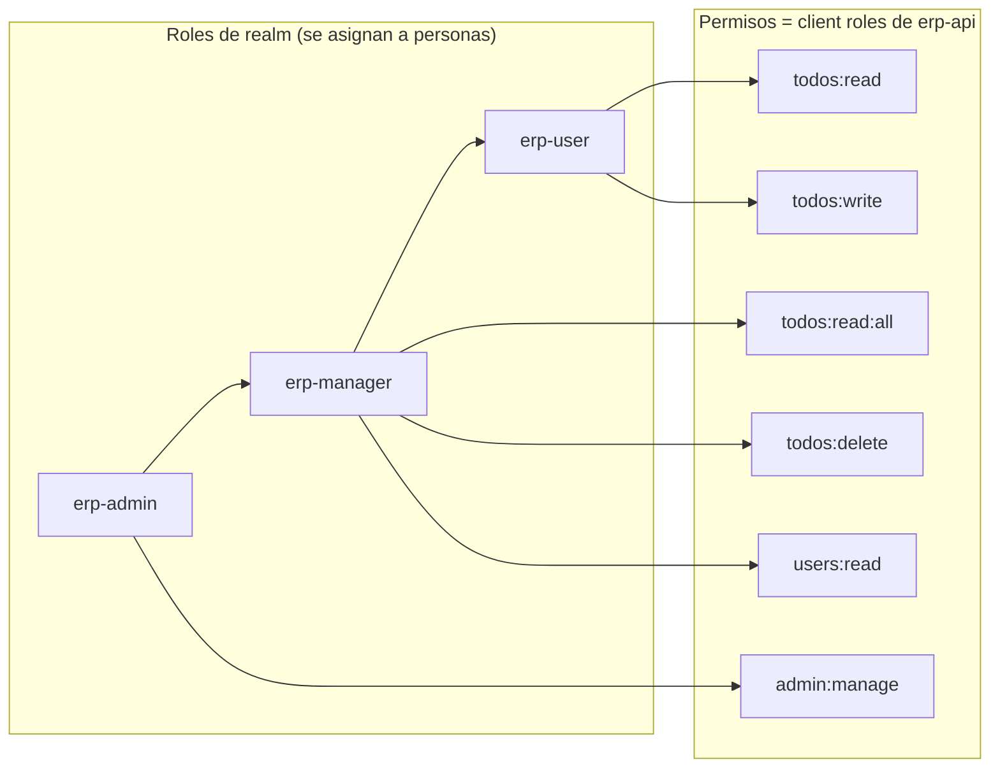
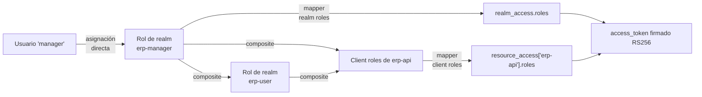
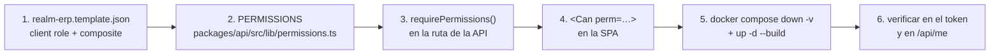

# Autenticación y autorización

El modelo completo de identidad de la demo: quién eres (Keycloak), qué puedes hacer (permisos
que viajan en el token) y qué datos puedes ver (regla de visibilidad en la API).

Realm: **`erp`**. Emisor público: `http://localhost:8080/realms/erp`.

---

## 1. Dos conceptos que no hay que mezclar

La confusión habitual con Keycloak es meter todo en "roles". Aquí hay **dos niveles separados** y
la separación es el corazón de la demo.

### Roles de realm — el puesto de trabajo

```
erp-user      erp-manager      erp-admin
```

Son **roles de negocio**. Es lo único que se asigna a las personas. Se leen bien en una lista de
usuarios y en el token viajan en `realm_access.roles`. La aplicación **no toma decisiones de
autorización con ellos**: solo los muestra en la interfaz ("Manager Demo · erp-manager").

### Permisos — *client roles* del cliente `erp-api`

```
todos:read      todos:read:all      todos:write
todos:delete    users:read          admin:manage
```

Son **capacidades técnicas**, definidas dentro del cliente `erp-api` y no del realm. Nunca se
asignan directamente a un usuario: se obtienen **a través** de un rol de realm. En el token
viajan en `resource_access["erp-api"].roles`, y son lo único que la API comprueba
(`requirePermissions`) y lo único que la SPA usa para mostrar u ocultar (`<Can perm="…">`).

### Por qué separarlos

| Sin separación (solo roles) | Con separación |
|---|---|
| Cada endpoint nuevo obliga a decidir qué roles lo pueden usar y a repetir esa lista en el código: `if (roles.includes('manager') \|\| roles.includes('admin'))`. | El endpoint declara **una capacidad**: `requirePermissions('todos:delete')`. Da igual qué roles la tengan. |
| Añadir un rol intermedio ("supervisor") obliga a repasar todos los `if` del backend. | Añadir un rol es definir un compuesto nuevo en el realm. **Cero cambios de código.** |
| Los permisos de un usuario están repartidos por el código. | Están en un sitio: la composición del realm, versionada en `realm-erp.template.json`. |
| El token dice el puesto, no lo que se puede hacer. | El token trae la lista literal de capacidades: se lee de un vistazo por qué algo dio 403. |

El precio es un concepto más que explicar. Es exactamente el mismo modelo que usan los
proveedores cloud (roles → políticas → permisos).

---

## 2. Tabla de composición

Los roles de realm son **compuestos**: agregan permisos y, además, otros roles de realm.

| Rol de realm | Compone | Permisos efectivos (`resource_access.erp-api.roles`) |
|---|---|---|
| `erp-user` | `todos:read`, `todos:write` | `todos:read`, `todos:write` |
| `erp-manager` | **`erp-user`** + `todos:read:all`, `todos:delete`, `users:read` | `todos:read`, `todos:write`, `todos:read:all`, `todos:delete`, `users:read` |
| `erp-admin` | **`erp-manager`** + `admin:manage` | los cinco anteriores + `admin:manage` |



La herencia es **transitiva**: `erp-admin` no repite los permisos de `erp-user`, los recibe a
través de `erp-manager`. Keycloak expande la cadena completa al emitir el token, así que la
aplicación nunca tiene que resolver jerarquías.

**`default-roles-erp` incluye `erp-user`**: cualquier usuario nuevo del realm (aunque lo cree un
administrador a mano) nace con permisos básicos y la aplicación le funciona.

### Usuarios demo

| Usuario | Rol asignado | Contraseña |
|---|---|---|
| `admin` | `erp-admin` | `DEMO_ADMIN_PASSWORD` en `.env.example` |
| `manager` | `erp-manager` | `DEMO_MANAGER_PASSWORD` en `.env.example` |
| `worker` | `erp-user` | `DEMO_USER_PASSWORD` en `.env.example` |

Los tres se importan con el realm: `enabled: true`, `emailVerified: true` y credencial de tipo
`password` **no temporal**.

---

## 3. Clientes del realm

| Cliente | Tipo | Configuración | Para qué |
|---|---|---|---|
| `erp-app` | **Público** (SPA) | PKCE `S256`, *standard flow* ON, *direct access grants* ON, **sin secreto** | Es quien pide los tokens desde el navegador. Al ser público no puede guardar un secreto, por eso PKCE es obligatorio. |
| `erp-api` | **Confidencial** | *standard flow* OFF, sin *service accounts* | No inicia sesiones de nadie. Existe para dos cosas: **contener los client roles** (los permisos) y **ser la audiencia** de los tokens. |

- **Redirect URIs de `erp-app`**: `http://localhost:5173/*` y `http://localhost:8081/*`
  (desarrollo y perfil `full`). *Web origins*: las mismas **sin** comodín de path.
  `postLogoutRedirectUris`: `+` (equivale a "las mismas que las de redirección").
- **Direct access grants ON** está activado a propósito para poder pedir tokens por
  `curl`/CI con `grant_type=password` (ver [sección 7](#7-obtener-un-token-y-llamar-a-la-api-con-curl)).
  En un despliegue real de producción se desactivaría.
- **`aud` debe contener `erp-api`**: se consigue con un protocol mapper `oidc-audience-mapper`
  declarado en `erp-app`. Sin él, el token no llevaría `erp-api` en `aud` y la API lo rechazaría.

---

## 4. Cómo viajan los roles en el token



Contenido obligatorio del access token (garantizado por el realm importado):

| Claim | Uso |
|---|---|
| `sub` | Identidad. Es **la clave primaria** de `erp.users`. |
| `preferred_username`, `email`, `name` | Provisión JIT y cabecera de la SPA. |
| `realm_access.roles` | Roles de negocio, para mostrar. |
| `resource_access["erp-api"].roles` | **Permisos**, para autorizar. |
| `aud` | Debe contener `erp-api`; si no, la API rechaza el token. |
| `iss` | Debe ser exactamente `http://localhost:8080/realms/erp`. |

### Ejemplo de access token decodificado (usuario `manager`)

```json
{
  "exp": 1753960800,
  "iat": 1753960500,
  "jti": "7c2f5a1e-9d43-4b8a-93ef-1d0c2b6a5f10",
  "iss": "http://localhost:8080/realms/erp",
  "aud": ["erp-api", "account"],
  "sub": "3f1c8a52-6e77-4a19-9c0b-2f5d7e8a1b34",
  "typ": "Bearer",
  "azp": "erp-app",
  "sid": "b0d9a4e7-53c1-4f2a-8a6d-91e3c7b5f204",
  "acr": "1",
  "allowed-origins": [
    "http://localhost:5173",
    "http://localhost:8081"
  ],
  "realm_access": {
    "roles": [
      "default-roles-erp",
      "erp-manager",
      "erp-user",
      "offline_access",
      "uma_authorization"
    ]
  },
  "resource_access": {
    "erp-api": {
      "roles": [
        "todos:read",
        "todos:write",
        "todos:read:all",
        "todos:delete",
        "users:read"
      ]
    },
    "account": {
      "roles": ["manage-account", "view-profile"]
    }
  },
  "scope": "openid profile email",
  "email_verified": true,
  "name": "Manager Demo",
  "preferred_username": "manager",
  "email": "manager@erp.local"
}
```

Cosas que leer en ese payload:

- `realm_access.roles` trae **`erp-manager` y `erp-user`**: la composición ya está expandida.
- `resource_access["erp-api"].roles` trae los cinco permisos efectivos, incluidos los heredados
  de `erp-user`. La aplicación no resuelve jerarquías: solo lee esta lista.
- `aud` incluye `erp-api` (gracias al *audience mapper*) y `account` (roles por defecto del
  realm). Basta con que **contenga** el valor esperado.
- `azp` es `erp-app`: quién pidió el token. No se usa para autorizar.
- Los roles `offline_access`, `uma_authorization`, `manage-account` y `view-profile` son de
  Keycloak, no del ERP; la aplicación los ignora.

---

## 5. Cómo valida la API

La API **no usa ningún adaptador de Keycloak**: valida el JWT con `jose`, que es estándar OIDC y
funcionaría igual contra Auth0, Entra ID o cualquier otro emisor.

```ts
// esencia de src/plugins/auth.ts
const jwks = createRemoteJWKSet(
  new URL(`${env.KEYCLOAK_INTERNAL_ISSUER}/protocol/openid-connect/certs`),
)

const { payload } = await jwtVerify(token, jwks, {
  issuer:   env.KEYCLOAK_ISSUER,     // http://localhost:8080/realms/erp
  audience: env.KEYCLOAK_AUDIENCE,   // erp-api
})
```

Comprobaciones, en orden:

1. **Cabecera `Authorization: Bearer <token>`** presente y bien formada → si no, `401`.
2. **Firma** contra la clave pública del realm. Las claves se descargan del endpoint JWKS
   **por la red interna de Docker** (`http://keycloak:8080/...`, derivado de
   `KEYCLOAK_INTERNAL_ISSUER`) y `jose` las cachea y las renueva sola cuando aparece un `kid`
   desconocido — así una rotación de claves no obliga a reiniciar la API.
3. **`iss` idéntico a `KEYCLOAK_ISSUER`** (`http://localhost:8080/realms/erp`, el issuer
   **público**, que es el que traen los tokens). El motivo de que issuer público e interno sean
   distintos está en [`arquitectura.md`](arquitectura.md#issuer-publico-vs-issuer-interno).
4. **`aud` contiene `KEYCLOAK_AUDIENCE`** (`erp-api`). Sin esta comprobación, un token emitido
   para *otra* aplicación del mismo realm serviría para llamar a esta API.
5. **`exp`/`nbf`** dentro de margen (lo hace `jwtVerify`).
6. Se construye el `AuthContext`:

   ```ts
   interface AuthContext {
     sub: string
     username: string
     email: string | null
     name: string | null
     realmRoles: string[]      // realm_access.roles
     permissions: Permission[] // resource_access['erp-api'].roles ∩ PERMISSIONS
     token: string
   }
   ```

   Los permisos se **filtran** contra la constante `PERMISSIONS`: cualquier rol de cliente que no
   esté en la lista conocida se descarta, de modo que el tipo `Permission` sigue siendo cierto en
   tiempo de ejecución.
7. **Provisión JIT**: `INSERT … ON CONFLICT (id) DO UPDATE` en `erp.users` con `id = sub`,
   refrescando `username`, `email`, `display_name` y `last_seen_at`.

Después, cada ruta declara lo que exige:

```ts
app.delete('/todos/:id', {
  preHandler: [app.authenticate, app.requirePermissions('todos:delete')],
  schema: { /* JSON Schema */ },
}, handler)
```

`requirePermissions` es un **AND lógico**: exige todos los permisos que recibe. Si falta alguno
responde `403` con el sobre estándar `{ error: { code, message, statusCode } }`.

### Permisos exigidos por endpoint

| Endpoint | Permiso |
|---|---|
| `GET /health`, `GET /health/ready`, `GET /docs` | *(público, sin token)* |
| `GET /api/me` | *(solo autenticación)* |
| `GET /api/todos` | `todos:read` (+ `todos:read:all` si `scope=all`) |
| `GET /api/todos/:id` | `todos:read` |
| `POST /api/todos` | `todos:write` |
| `PATCH /api/todos/:id` | `todos:write` |
| `DELETE /api/todos/:id` | `todos:delete` |
| `POST /api/todos/seed-demo` | `todos:write` |
| `POST /api/todos/:id/notify` | `todos:write` |
| `POST /api/todos/:id/attachments` | `todos:write` |
| `GET /api/todos/:id/attachments` | `todos:read` |
| `GET /api/attachments/:id` | `todos:read` |
| `DELETE /api/attachments/:id` | `todos:delete` |
| `GET /api/admin/users` | `users:read` |
| `GET /api/admin/stats` | `admin:manage` |
| `GET /api/admin/audit` | `admin:manage` |

---

## 6. Regla de visibilidad de los todos

Tener permiso para *una operación* no significa poder aplicarla a *cualquier fila*. Los permisos
resuelven el "qué"; la regla de visibilidad resuelve el "sobre qué".

> Si el usuario **no** tiene `todos:read:all`, solo ve y modifica los todos donde
> `owner_id = auth.sub` **o** `assignee_id = auth.sub`.
> Con `todos:read:all` ve todos los registros.

Consecuencias concretas:

- El parámetro `scope` de `GET /api/todos` acepta `mine` (por defecto) y `all`.
  **`scope=all` exige `todos:read:all`**; sin ese permiso la respuesta es `403`, no una lista
  recortada en silencio. Es preferible un error explícito a un resultado engañoso.
- La restricción se aplica **en la cláusula `WHERE` de SQL**, no filtrando en memoria: un usuario
  sin `todos:read:all` no puede ni siquiera contar cuántas tareas ajenas existen.
- Vale también para lecturas por id: `GET /api/todos/:id` de una tarea ajena devuelve **`404`**,
  no `403`. Un `403` confirmaría que el recurso existe.
- `worker` (solo `erp-user`) **tiene `todos:write`** y por tanto puede editar… pero solo lo suyo
  o lo que le han asignado. Los dos mecanismos se combinan.
- El **`scope` efectivo** (ya resuelto tras comprobar permisos) y el `sub` forman parte de la
  clave de caché, para que dos usuarios distintos jamás compartan una entrada.

---

## 7. Obtener un token y llamar a la API con curl

`erp-app` tiene *direct access grants* activado, así que se puede pedir un token sin navegador.
Las contraseñas se toman del `.env` para no escribirlas nunca en la terminal ni en un documento.

```bash
cd /home/mapineda48/Repo/mapineda48/KeyCloak-Demo
set -a; source .env; set +a
```

### Función auxiliar

```bash
get_token() {
  # uso: get_token <usuario> <contraseña>
  curl -s -X POST "http://localhost:8080/realms/erp/protocol/openid-connect/token" \
    -H 'Content-Type: application/x-www-form-urlencoded' \
    -d 'grant_type=password' \
    -d 'client_id=erp-app' \
    -d 'scope=openid profile email' \
    --data-urlencode "username=$1" \
    --data-urlencode "password=$2" \
  | jq -r '.access_token'
}

WORKER_TOKEN=$(get_token "$DEMO_USER_USERNAME"    "$DEMO_USER_PASSWORD")
MANAGER_TOKEN=$(get_token "$DEMO_MANAGER_USERNAME" "$DEMO_MANAGER_PASSWORD")
ADMIN_TOKEN=$(get_token "$DEMO_ADMIN_USERNAME"    "$DEMO_ADMIN_PASSWORD")
```

Sin `jq` instalado, sustituye la última línea del `curl` por:

```bash
| node -e "let s='';process.stdin.on('data',d=>s+=d).on('end',()=>console.log(JSON.parse(s).access_token))"
```

`client_id=erp-app` no lleva `client_secret` porque es un **cliente público**. Si por error usas
`erp-api`, Keycloak responde `unauthorized_client`: ese cliente tiene el *standard flow*
desactivado y no está pensado para iniciar sesiones.

### Ver el payload del token

```bash
node -e "
  const [,,t] = process.argv;
  const p = Buffer.from(t.split('.')[1].replace(/-/g,'+').replace(/_/g,'/'), 'base64').toString('utf8');
  console.log(JSON.stringify(JSON.parse(p), null, 2));
" "$MANAGER_TOKEN"
```

Con `jq` moderno también vale:

```bash
echo "$MANAGER_TOKEN" | jq -R 'split(".")[1] | @base64d | fromjson'
```

### Llamadas de ejemplo

```bash
# Perfil, roles y permisos vistos por la API
curl -s http://localhost:3000/api/me -H "Authorization: Bearer $WORKER_TOKEN" | jq

# Crear datos de ejemplo (idempotente)
curl -s -X POST http://localhost:3000/api/todos/seed-demo \
  -H "Authorization: Bearer $WORKER_TOKEN" | jq
# { "created": 6 }

# Listado propio, mostrando la cabecera de caché
curl -si "http://localhost:3000/api/todos?status=todo&page=1&pageSize=20" \
  -H "Authorization: Bearer $WORKER_TOKEN" | grep -i '^x-cache'

# scope=all SIN el permiso todos:read:all → 403
curl -s -o /dev/null -w '%{http_code}\n' "http://localhost:3000/api/todos?scope=all" \
  -H "Authorization: Bearer $WORKER_TOKEN"
# 403

# scope=all CON el permiso → 200
curl -s "http://localhost:3000/api/todos?scope=all" \
  -H "Authorization: Bearer $MANAGER_TOKEN" | jq '.total'

# Crear una tarea
TODO_ID=$(curl -s -X POST http://localhost:3000/api/todos \
  -H "Authorization: Bearer $WORKER_TOKEN" \
  -H 'Content-Type: application/json' \
  -d '{"title":"Revisar el cierre mensual","priority":2,"status":"todo"}' | jq -r '.id')

# Borrar con worker (le falta todos:delete) → 403
curl -s -X DELETE "http://localhost:3000/api/todos/$TODO_ID" \
  -H "Authorization: Bearer $WORKER_TOKEN" | jq
# { "error": { "code": "FORBIDDEN", "message": "…", "statusCode": 403 } }

# Borrar con manager → 200 con { id, deleted, removedAttachments }
curl -s -o /dev/null -w '%{http_code}\n' -X DELETE "http://localhost:3000/api/todos/$TODO_ID" \
  -H "Authorization: Bearer $MANAGER_TOKEN"

# Panel de administración: solo admin
curl -s http://localhost:3000/api/admin/stats -H "Authorization: Bearer $ADMIN_TOKEN" | jq
curl -s -o /dev/null -w '%{http_code}\n' http://localhost:3000/api/admin/stats \
  -H "Authorization: Bearer $MANAGER_TOKEN"
# 403

# Subir un adjunto (multipart, campo 'file')
curl -s -X POST "http://localhost:3000/api/todos/$TODO_ID/attachments" \
  -H "Authorization: Bearer $WORKER_TOKEN" \
  -F "file=@./README.md;type=text/markdown" | jq

# Notificar por correo (modo dry-run si RESEND_API_KEY está vacía)
curl -s -X POST "http://localhost:3000/api/todos/$TODO_ID/notify" \
  -H "Authorization: Bearer $WORKER_TOKEN" \
  -H 'Content-Type: application/json' \
  -d '{}' | jq
# { "id": null, "delivered": false, "provider": "dry-run", "reason": "…" }
```

### Sin token o con token inválido

```bash
curl -s -o /dev/null -w '%{http_code}\n' http://localhost:3000/api/todos          # 401
curl -s -o /dev/null -w '%{http_code}\n' http://localhost:3000/api/todos \
  -H 'Authorization: Bearer no-es-un-jwt'                                          # 401
```

---

## 8. Añadir un permiso nuevo de punta a punta

Ejemplo: **`reports:export`**, que solo tendrán `erp-manager` y `erp-admin`.

### Paso 1 — Declararlo en la plantilla del realm

`infra/keycloak/realm-erp.template.json`. Dos ediciones:

**a) El client role dentro de `erp-api`**, en `clientRoles` (o el array de roles de cliente):

```json
{
  "name": "reports:export",
  "description": "Exportar informes"
}
```

**b) Añadirlo al compuesto del rol de realm** que debe tenerlo. En el bloque `composites` de
`erp-manager`:

```json
"composites": {
  "realm": ["erp-user"],
  "client": {
    "erp-api": ["todos:read:all", "todos:delete", "users:read", "reports:export"]
  }
}
```

`erp-admin` lo hereda automáticamente porque compone `erp-manager`. **No hay que tocar los
usuarios**: ese es exactamente el beneficio del modelo.

### Paso 2 — Declararlo en la API

`packages/api/src/lib/permissions.ts`:

```ts
export const PERMISSIONS = [
  'todos:read', 'todos:read:all', 'todos:write',
  'todos:delete', 'users:read', 'admin:manage',
  'reports:export',
] as const
```

El tipo `Permission` se deriva de esa constante, así que a partir de aquí TypeScript conoce el
permiso nuevo en toda la API. Si te saltas este paso, `authenticate` **filtra** el rol del token
por desconocido y el permiso nunca llega al `AuthContext`.

### Paso 3 — Exigirlo en la ruta

```ts
app.get('/reports/export', {
  preHandler: [app.authenticate, app.requirePermissions('reports:export')],
  schema: { /* … */ },
}, handler)
```

Para exigir varios a la vez: `app.requirePermissions('reports:export', 'todos:read:all')` (AND).

### Paso 4 — Usarlo en la SPA

```tsx
<Can perm="reports:export">
  <button onClick={exportReport}>Exportar informe</button>
</Can>
```

Si el tipo de permisos está tipado también en el frontend, añádelo a esa unión. Recuerda que
`<Can>` es **cosmético**: oculta la interfaz, pero quien manda es el `requirePermissions` del
paso 3.

### Paso 5 — Reimportar el realm

Keycloak **no** reimporta un realm que ya existe. Para que el permiso nuevo aparezca:

```bash
docker compose down -v && docker compose up -d --build
```

Eso borra los volúmenes (incluida la base de datos de Keycloak) y fuerza una importación limpia.
Si no quieres perder los datos de la demo, la alternativa es crear el client role y editar el
compuesto a mano en <http://localhost:8080/admin> — pero recuerda reflejarlo igualmente en la
plantilla, o el siguiente arranque limpio lo perderá.

### Paso 6 — Comprobarlo

```bash
set -a; source .env; set +a
TOKEN=$(get_token "$DEMO_MANAGER_USERNAME" "$DEMO_MANAGER_PASSWORD")
node -e "
  const [,,t]=process.argv;
  const p=JSON.parse(Buffer.from(t.split('.')[1].replace(/-/g,'+').replace(/_/g,'/'),'base64').toString());
  console.log(p.resource_access['erp-api'].roles);
" "$TOKEN"
# [... , 'reports:export']

curl -s http://localhost:3000/api/me -H "Authorization: Bearer $TOKEN" | jq '.permissions'
```

### Resumen del recorrido



---

## 9. Errores frecuentes de autenticación

| Síntoma | Causa habitual | Solución |
|---|---|---|
| `401` con un token recién emitido | El claim `iss` no coincide con `KEYCLOAK_ISSUER` (barra final, `127.0.0.1` en vez de `localhost`, o `KC_HOSTNAME` distinto de `KEYCLOAK_PUBLIC_URL`) | Igualar `KEYCLOAK_PUBLIC_URL` en `.env` con la URL desde la que el navegador pide el token |
| `401` con mensaje sobre la audiencia | Falta el *audience mapper* en `erp-app`, o `KEYCLOAK_AUDIENCE` no vale `erp-api` | Verificar el mapper en la plantilla del realm y reimportar (`down -v`) |
| `403` en `scope=all` | Falta `todos:read:all` | Usar `manager`/`admin`, o añadir el permiso al compuesto |
| El permiso nuevo no aparece en el token | El realm no se reimportó (el volumen ya existía) | `docker compose down -v && docker compose up -d --build` |
| Error de CORS en el navegador | El origen no está en *web origins* de `erp-app` ni en `CORS_ORIGINS` de la API | Revisar `APP_DEV_URL`/`APP_PROD_URL` en `.env` |
| `Keycloak instance already initialized` en la consola de la SPA | Se llamó a `keycloak.init()` dos veces (StrictMode) | La promesa de init debe estar memorizada a nivel de módulo en `src/auth/keycloak.ts` |

Más casos, incluidos los de infraestructura, en [`operacion.md`](operacion.md#resolucion-de-problemas).
