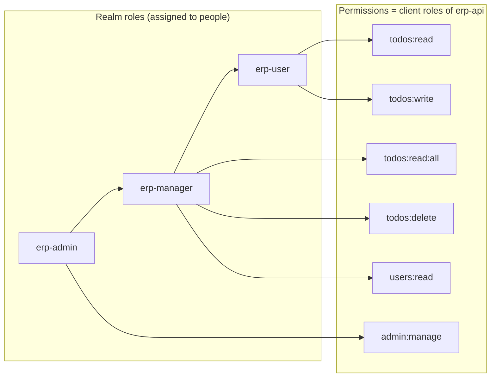
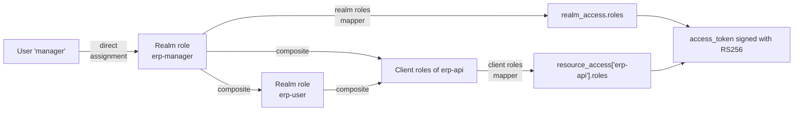
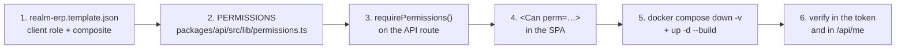

# Authentication and authorization

The full identity model of the demo: who you are (Keycloak), what you are allowed to do
(permissions that travel inside the token) and which data you are allowed to see (the visibility
rule in the API).

Realm: **`erp`**. Public issuer: `http://localhost:8080/realms/erp`.

---

## 1. Two concepts that must not be mixed

The usual mistake with Keycloak is to push everything into "roles". Here there are **two separate
levels**, and that separation is the heart of the demo.

### Realm roles — the job title

```
erp-user      erp-manager      erp-admin
```

These are **business roles**. They are the only thing assigned to people. They read well in a user
list and they travel in the token under `realm_access.roles`. The application **does not make
authorization decisions with them**: it only displays them in the UI ("Manager Demo · erp-manager").

### Permissions — *client roles* of the `erp-api` client

```
todos:read      todos:read:all      todos:write
todos:delete    users:read          admin:manage
```

These are **technical capabilities**, defined inside the `erp-api` client rather than on the realm.
They are never assigned directly to a user: they are acquired **through** a realm role. In the
token they travel under `resource_access["erp-api"].roles`, and they are the only thing the API
checks (`requirePermissions`) and the only thing the SPA uses to show or hide
(`<Can perm="…">`).

### Why separate them

| Without separation (roles only) | With separation |
|---|---|
| Every new endpoint forces you to decide which roles may use it and to repeat that list in code: `if (roles.includes('manager') \|\| roles.includes('admin'))`. | The endpoint declares **one capability**: `requirePermissions('todos:delete')`. It does not care which roles carry it. |
| Adding an intermediate role ("supervisor") forces you to revisit every `if` in the backend. | Adding a role means defining a new composite in the realm. **Zero code changes.** |
| A user's permissions are scattered across the code. | They live in one place: the realm composition, versioned in `realm-erp.template.json`. |
| The token tells you the job title, not what can be done. | The token carries the literal list of capabilities: you can see at a glance why something returned 403. |

The price is one more concept to explain. It is exactly the model cloud providers use
(roles → policies → permissions).

---

## 2. Composition table

Realm roles are **composite**: they aggregate permissions and also other realm roles.

| Realm role | Composes | Effective permissions (`resource_access.erp-api.roles`) |
|---|---|---|
| `erp-user` | `todos:read`, `todos:write` | `todos:read`, `todos:write` |
| `erp-manager` | **`erp-user`** + `todos:read:all`, `todos:delete`, `users:read` | `todos:read`, `todos:write`, `todos:read:all`, `todos:delete`, `users:read` |
| `erp-admin` | **`erp-manager`** + `admin:manage` | the five above + `admin:manage` |



Inheritance is **transitive**: `erp-admin` does not repeat the permissions of `erp-user`, it
receives them through `erp-manager`. Keycloak expands the whole chain when it issues the token, so
the application never has to resolve hierarchies.

**`default-roles-erp` includes `erp-user`**: any new user in the realm (even one created by hand by
an administrator) is born with the basic permissions and the application works for them.

### Demo users

| User | Assigned role | Password |
|---|---|---|
| `admin` | `erp-admin` | `DEMO_ADMIN_PASSWORD` in `.env.example` |
| `manager` | `erp-manager` | `DEMO_MANAGER_PASSWORD` in `.env.example` |
| `worker` | `erp-user` | `DEMO_USER_PASSWORD` in `.env.example` |

All three are imported with the realm: `enabled: true`, `emailVerified: true` and a `password`
credential that is **not temporary**.

---

## 3. Realm clients

| Client | Type | Configuration | What for |
|---|---|---|---|
| `erp-app` | **Public** (SPA) | PKCE `S256`, *standard flow* ON, *direct access grants* ON, **no secret** | This is what requests tokens from the browser. Being public it cannot keep a secret, which is why PKCE is mandatory. |
| `erp-api` | **Confidential** | *standard flow* OFF, no *service accounts* | It starts no sessions for anybody. It exists for two reasons: to **hold the client roles** (the permissions) and to **be the audience** of the tokens. |

- **Redirect URIs for `erp-app`**: `http://localhost:5173/*` and `http://localhost:8081/*`
  (development and the `full` profile). *Web origins*: the same ones **without** the path wildcard.
  `postLogoutRedirectUris`: `+` (meaning "the same as the redirect URIs").
- **Direct access grants ON** is enabled on purpose so tokens can be requested from
  `curl`/CI with `grant_type=password` (see [section 7](#7-getting-a-token-and-calling-the-api-with-curl)).
  In a real production deployment you would turn it off.
- **`aud` must contain `erp-api`**: that comes from an `oidc-audience-mapper` protocol mapper
  declared on `erp-app`. Without it the token would not carry `erp-api` in `aud` and the API would
  reject it.

---

## 4. How roles travel inside the token



Mandatory contents of the access token (guaranteed by the imported realm):

| Claim | Use |
|---|---|
| `sub` | Identity. It is **the primary key** of `erp.users`. |
| `preferred_username`, `email`, `name` | JIT provisioning and the SPA header. |
| `realm_access.roles` | Business roles, for display. |
| `resource_access["erp-api"].roles` | **Permissions**, for authorization. |
| `aud` | Must contain `erp-api`; otherwise the API rejects the token. |
| `iss` | Must be exactly `http://localhost:8080/realms/erp`. |

### Example of a decoded access token (user `manager`)

```json
{
  "exp": 1753960800,
  "iat": 1753960500,
  "jti": "7c2f5a1e-9d43-4b8a-93ef-1d0c2b6a5f10",
  "iss": "http://localhost:8080/realms/erp",
  "aud": ["erp-api", "account"],
  "sub": "3f1c8a52-6e77-4a19-9c0b-2f5d7e8a1b34",
  "typ": "Bearer",
  "azp": "erp-app",
  "sid": "b0d9a4e7-53c1-4f2a-8a6d-91e3c7b5f204",
  "acr": "1",
  "allowed-origins": [
    "http://localhost:5173",
    "http://localhost:8081"
  ],
  "realm_access": {
    "roles": [
      "default-roles-erp",
      "erp-manager",
      "erp-user",
      "offline_access",
      "uma_authorization"
    ]
  },
  "resource_access": {
    "erp-api": {
      "roles": [
        "todos:read",
        "todos:write",
        "todos:read:all",
        "todos:delete",
        "users:read"
      ]
    },
    "account": {
      "roles": ["manage-account", "view-profile"]
    }
  },
  "scope": "openid profile email",
  "email_verified": true,
  "name": "Manager Demo",
  "preferred_username": "manager",
  "email": "manager@erp.local"
}
```

Things worth reading in that payload:

- `realm_access.roles` carries **both `erp-manager` and `erp-user`**: the composition is already
  expanded.
- `resource_access["erp-api"].roles` carries the five effective permissions, including the ones
  inherited from `erp-user`. The application resolves no hierarchies: it just reads this list.
- `aud` includes `erp-api` (thanks to the *audience mapper*) and `account` (default realm roles).
  It is enough that it **contains** the expected value.
- `azp` is `erp-app`: who asked for the token. It is not used for authorization.
- The `offline_access`, `uma_authorization`, `manage-account` and `view-profile` roles belong to
  Keycloak, not to the ERP; the application ignores them.

---

## 5. How the API validates it

The API **uses no Keycloak adapter**: it validates the JWT with `jose`, which is plain OIDC and
would work the same against Auth0, Entra ID or any other issuer.

```ts
// the essence of src/plugins/auth.ts
const jwks = createRemoteJWKSet(
  new URL(`${env.KEYCLOAK_INTERNAL_ISSUER}/protocol/openid-connect/certs`),
)

const { payload } = await jwtVerify(token, jwks, {
  issuer:   env.KEYCLOAK_ISSUER,     // http://localhost:8080/realms/erp
  audience: env.KEYCLOAK_AUDIENCE,   // erp-api
})
```

The checks, in order:

1. The **`Authorization: Bearer <token>` header** is present and well formed → otherwise `401`.
2. **Signature** against the realm's public key. The keys are downloaded from the JWKS endpoint
   **over the internal Docker network** (`http://keycloak:8080/...`, derived from
   `KEYCLOAK_INTERNAL_ISSUER`) and `jose` caches them and refreshes them by itself when an unknown
   `kid` shows up — so a key rotation does not force an API restart.
3. **`iss` identical to `KEYCLOAK_ISSUER`** (`http://localhost:8080/realms/erp`, the **public**
   issuer, which is the one tokens carry). Why the public and internal issuers differ is explained
   in [`architecture.md`](architecture.md#public-issuer-vs-internal-issuer).
4. **`aud` contains `KEYCLOAK_AUDIENCE`** (`erp-api`). Without this check, a token issued for
   *another* application in the same realm would be good enough to call this API.
5. **`exp`/`nbf`** within tolerance (handled by `jwtVerify`).
6. The `AuthContext` is built:

   ```ts
   interface AuthContext {
     sub: string
     username: string
     email: string | null
     name: string | null
     realmRoles: string[]      // realm_access.roles
     permissions: Permission[] // resource_access['erp-api'].roles ∩ PERMISSIONS
     token: string
   }
   ```

   Permissions are **filtered** against the `PERMISSIONS` constant: any client role that is not in
   the known list is dropped, so the `Permission` type stays true at runtime.
7. **JIT provisioning**: `INSERT … ON CONFLICT (id) DO UPDATE` into `erp.users` with `id = sub`,
   refreshing `username`, `email`, `display_name` and `last_seen_at`.

From there, each route declares what it demands:

```ts
app.delete('/todos/:id', {
  preHandler: [app.authenticate, app.requirePermissions('todos:delete')],
  schema: { /* JSON Schema */ },
}, handler)
```

`requirePermissions` is a **logical AND**: it demands every permission it receives. If one is
missing it answers `403` with the standard envelope `{ error: { code, message, statusCode } }`.

### Permissions required per endpoint

| Endpoint | Permission |
|---|---|
| `GET /api/health`, `GET /api/health/ready`, `GET /api/docs` | *(public, no token)* |
| `GET /api/me` | *(authentication only)* |
| `GET /api/todos` | `todos:read` (+ `todos:read:all` if `scope=all`) |
| `GET /api/todos/:id` | `todos:read` |
| `POST /api/todos` | `todos:write` |
| `PATCH /api/todos/:id` | `todos:write` |
| `DELETE /api/todos/:id` | `todos:delete` |
| `POST /api/todos/seed-demo` | `todos:write` |
| `POST /api/todos/:id/notify` | `todos:write` |
| `POST /api/todos/:id/attachments` | `todos:write` |
| `GET /api/todos/:id/attachments` | `todos:read` |
| `GET /api/attachments/:id` | `todos:read` |
| `DELETE /api/attachments/:id` | `todos:delete` |
| `GET /api/admin/users` | `users:read` |
| `GET /api/admin/stats` | `admin:manage` |
| `GET /api/admin/audit` | `admin:manage` |

---

## 6. Todo visibility rule

Having permission for *an operation* does not mean being allowed to apply it to *any row*.
Permissions answer "what"; the visibility rule answers "on which data".

> If the user does **not** have `todos:read:all`, they only see and modify the todos where
> `owner_id = auth.sub` **or** `assignee_id = auth.sub`.
> With `todos:read:all` they see every record.

Concrete consequences:

- The `scope` parameter of `GET /api/todos` accepts `mine` (default) and `all`.
  **`scope=all` requires `todos:read:all`**; without that permission the answer is `403`, not a
  silently trimmed list. An explicit error beats a misleading result.
- The restriction is applied **in the SQL `WHERE` clause**, not by filtering in memory: a user
  without `todos:read:all` cannot even count how many other people's tasks exist.
- It applies to reads by id too: `GET /api/todos/:id` for somebody else's task returns **`404`**,
  not `403`. A `403` would confirm that the resource exists.
- `worker` (only `erp-user`) **does have `todos:write`** and can therefore edit… but only their own
  tasks or the ones assigned to them. The two mechanisms compose.
- The **effective `scope`** (already resolved after checking permissions) and the `sub` are part of
  the cache key, so two different users never share an entry.

---

## 7. Getting a token and calling the API with curl

`erp-app` has *direct access grants* enabled, so a token can be requested without a browser.
Passwords are read from `.env` so they never have to be typed into a terminal or into a document.

```bash
cd /home/mapineda48/Repo/mapineda48/KeyCloak-Demo
set -a; source .env; set +a
```

### Helper function

```bash
get_token() {
  # usage: get_token <username> <password>
  curl -s -X POST "http://localhost:8080/realms/erp/protocol/openid-connect/token" \
    -H 'Content-Type: application/x-www-form-urlencoded' \
    -d 'grant_type=password' \
    -d 'client_id=erp-app' \
    -d 'scope=openid profile email' \
    --data-urlencode "username=$1" \
    --data-urlencode "password=$2" \
  | jq -r '.access_token'
}

WORKER_TOKEN=$(get_token "$DEMO_USER_USERNAME"    "$DEMO_USER_PASSWORD")
MANAGER_TOKEN=$(get_token "$DEMO_MANAGER_USERNAME" "$DEMO_MANAGER_PASSWORD")
ADMIN_TOKEN=$(get_token "$DEMO_ADMIN_USERNAME"    "$DEMO_ADMIN_PASSWORD")
```

Without `jq` installed, replace the last line of the `curl` with:

```bash
| node -e "let s='';process.stdin.on('data',d=>s+=d).on('end',()=>console.log(JSON.parse(s).access_token))"
```

`client_id=erp-app` carries no `client_secret` because it is a **public client**. If you use
`erp-api` by mistake, Keycloak answers `unauthorized_client`: that client has the *standard flow*
disabled and is not meant to start sessions.

### Inspecting the token payload

```bash
node -e "
  const [,,t] = process.argv;
  const p = Buffer.from(t.split('.')[1].replace(/-/g,'+').replace(/_/g,'/'), 'base64').toString('utf8');
  console.log(JSON.stringify(JSON.parse(p), null, 2));
" "$MANAGER_TOKEN"
```

With a modern `jq` this also works:

```bash
echo "$MANAGER_TOKEN" | jq -R 'split(".")[1] | @base64d | fromjson'
```

### Example calls

```bash
# Profile, roles and permissions as the API sees them
curl -s http://localhost:3000/api/me -H "Authorization: Bearer $WORKER_TOKEN" | jq

# Create sample data (idempotent)
curl -s -X POST http://localhost:3000/api/todos/seed-demo \
  -H "Authorization: Bearer $WORKER_TOKEN" | jq
# { "created": 6 }

# Own listing, showing the cache header
curl -si "http://localhost:3000/api/todos?status=todo&page=1&pageSize=20" \
  -H "Authorization: Bearer $WORKER_TOKEN" | grep -i '^x-cache'

# scope=all WITHOUT the todos:read:all permission → 403
curl -s -o /dev/null -w '%{http_code}\n' "http://localhost:3000/api/todos?scope=all" \
  -H "Authorization: Bearer $WORKER_TOKEN"
# 403

# scope=all WITH the permission → 200
curl -s "http://localhost:3000/api/todos?scope=all" \
  -H "Authorization: Bearer $MANAGER_TOKEN" | jq '.total'

# Create a task
TODO_ID=$(curl -s -X POST http://localhost:3000/api/todos \
  -H "Authorization: Bearer $WORKER_TOKEN" \
  -H 'Content-Type: application/json' \
  -d '{"title":"Review the monthly close","priority":2,"status":"todo"}' | jq -r '.id')

# Delete as worker (missing todos:delete) → 403
curl -s -X DELETE "http://localhost:3000/api/todos/$TODO_ID" \
  -H "Authorization: Bearer $WORKER_TOKEN" | jq
# { "error": { "code": "FORBIDDEN", "message": "…", "statusCode": 403 } }

# Delete as manager → 200 with { id, deleted, removedAttachments }
curl -s -o /dev/null -w '%{http_code}\n' -X DELETE "http://localhost:3000/api/todos/$TODO_ID" \
  -H "Authorization: Bearer $MANAGER_TOKEN"

# Administration panel: admin only
curl -s http://localhost:3000/api/admin/stats -H "Authorization: Bearer $ADMIN_TOKEN" | jq
curl -s -o /dev/null -w '%{http_code}\n' http://localhost:3000/api/admin/stats \
  -H "Authorization: Bearer $MANAGER_TOKEN"
# 403

# Upload an attachment (multipart, field 'file')
curl -s -X POST "http://localhost:3000/api/todos/$TODO_ID/attachments" \
  -H "Authorization: Bearer $WORKER_TOKEN" \
  -F "file=@./README.md;type=text/markdown" | jq

# Send an email notification (dry-run mode if RESEND_API_KEY is empty)
curl -s -X POST "http://localhost:3000/api/todos/$TODO_ID/notify" \
  -H "Authorization: Bearer $WORKER_TOKEN" \
  -H 'Content-Type: application/json' \
  -d '{}' | jq
# { "id": null, "delivered": false, "provider": "dry-run", "reason": "…" }
```

### With no token or an invalid token

```bash
curl -s -o /dev/null -w '%{http_code}\n' http://localhost:3000/api/todos          # 401
curl -s -o /dev/null -w '%{http_code}\n' http://localhost:3000/api/todos \
  -H 'Authorization: Bearer not-a-jwt'                                             # 401
```

---

## 8. Adding a new permission end to end

Example: **`reports:export`**, granted only to `erp-manager` and `erp-admin`.

### Step 1 — Declare it in the realm template

`infra/keycloak/realm-erp.template.json`. Two edits:

**a) The client role inside `erp-api`**, in `clientRoles` (or in the client roles array):

```json
{
  "name": "reports:export",
  "description": "Export reports"
}
```

**b) Add it to the composite of the realm role** that should carry it. In the `composites` block
of `erp-manager`:

```json
"composites": {
  "realm": ["erp-user"],
  "client": {
    "erp-api": ["todos:read:all", "todos:delete", "users:read", "reports:export"]
  }
}
```

`erp-admin` inherits it automatically because it composes `erp-manager`. **No user has to be
touched**: that is exactly the point of the model.

### Step 2 — Declare it in the API

`packages/api/src/lib/permissions.ts`:

```ts
export const PERMISSIONS = [
  'todos:read', 'todos:read:all', 'todos:write',
  'todos:delete', 'users:read', 'admin:manage',
  'reports:export',
] as const
```

The `Permission` type is derived from that constant, so from here on TypeScript knows the new
permission across the whole API. If you skip this step, `authenticate` **filters out** the role
from the token as unknown and the permission never reaches the `AuthContext`.

### Step 3 — Require it on the route

```ts
app.get('/reports/export', {
  preHandler: [app.authenticate, app.requirePermissions('reports:export')],
  schema: { /* … */ },
}, handler)
```

To require several at once: `app.requirePermissions('reports:export', 'todos:read:all')` (AND).

### Step 4 — Use it in the SPA

```tsx
<Can perm="reports:export">
  <button onClick={exportReport}>Export report</button>
</Can>
```

If the permission type is also typed in the frontend, add it to that union. Remember that `<Can>`
is **cosmetic**: it hides the UI, but the one in charge is the `requirePermissions` from step 3.

### Step 5 — Re-import the realm

Keycloak does **not** re-import a realm that already exists. For the new permission to show up:

```bash
docker compose down -v && docker compose up -d --build
```

That drops the volumes (including Keycloak's database) and forces a clean import. If you do not
want to lose the demo data, the alternative is to create the client role and edit the composite by
hand at <http://localhost:8080/admin> — but remember to mirror the change in the template too, or
the next clean start will lose it.

### Step 6 — Verify it

```bash
set -a; source .env; set +a
TOKEN=$(get_token "$DEMO_MANAGER_USERNAME" "$DEMO_MANAGER_PASSWORD")
node -e "
  const [,,t]=process.argv;
  const p=JSON.parse(Buffer.from(t.split('.')[1].replace(/-/g,'+').replace(/_/g,'/'),'base64').toString());
  console.log(p.resource_access['erp-api'].roles);
" "$TOKEN"
# [... , 'reports:export']

curl -s http://localhost:3000/api/me -H "Authorization: Bearer $TOKEN" | jq '.permissions'
```

### The route at a glance



---

## 9. Common authentication failures

| Symptom | Usual cause | Fix |
|---|---|---|
| `401` with a freshly issued token | The `iss` claim does not match `KEYCLOAK_ISSUER` (trailing slash, `127.0.0.1` instead of `localhost`, or `KC_HOSTNAME` different from `KEYCLOAK_PUBLIC_URL`) | Make `KEYCLOAK_PUBLIC_URL` in `.env` match the URL the browser uses to request the token |
| `401` with a message about the audience | The *audience mapper* is missing on `erp-app`, or `KEYCLOAK_AUDIENCE` is not `erp-api` | Check the mapper in the realm template and re-import (`down -v`) |
| `403` on `scope=all` | `todos:read:all` is missing | Use `manager`/`admin`, or add the permission to the composite |
| The new permission does not appear in the token | The realm was not re-imported (the volume already existed) | `docker compose down -v && docker compose up -d --build` |
| CORS error in the browser | The origin is not in *web origins* of `erp-app` nor in `CORS_ORIGINS` of the API | Review `APP_DEV_URL`/`APP_PROD_URL` in `.env` |
| `Keycloak instance already initialized` in the SPA console | `keycloak.init()` was called twice (StrictMode) | The init promise must be memoised at module level in `src/auth/keycloak.ts` |

More cases, including infrastructure ones, in
[`operations.md`](operations.md#troubleshooting).
