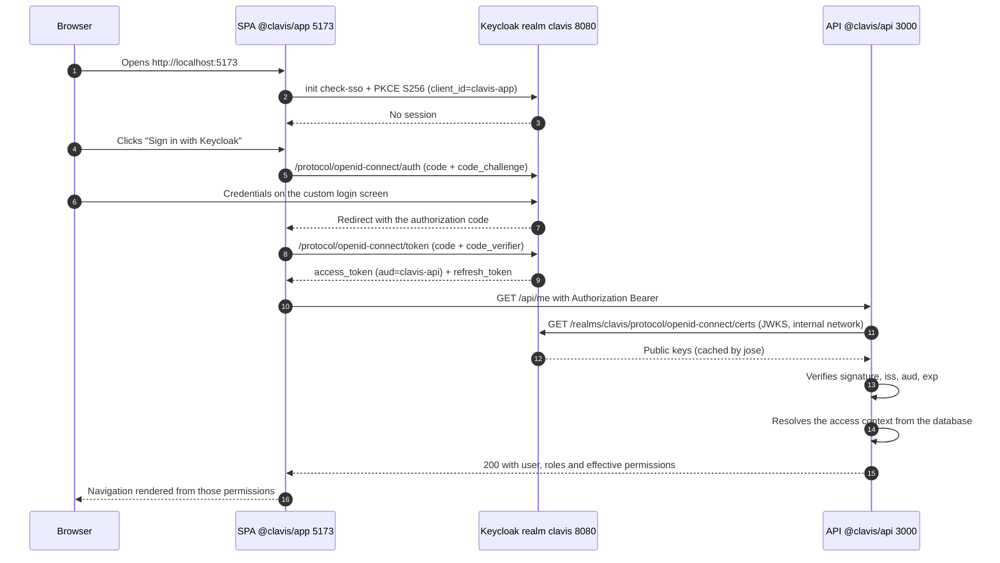

# Authentication

Everything Keycloak is responsible for in this lab: proving who somebody is, keeping the
session, issuing and signing the token, and running the flows around credentials — first login,
password reset, email.

Deliberately **not** in this document: what the authenticated user is allowed to do. The token
carries no permissions; the application decides, from its own database. That is
[`access-control.md`](access-control.md).

Realm: **`clavis`**. Public issuer: `http://localhost:8080/realms/clavis`.

---

## 1. The division of labour

| | Keycloak | The application |
|---|---|---|
| Stores | Credentials, sessions, required actions | Users, roles, permissions, exceptions, audit |
| Answers | *Who are you?* | *What may you do?* |
| Proof | A signed JWT | A row in `clavis.users` and what hangs off it |
| Changing it takes | A sign-in | Nothing — the next request already sees it |

The realm holds **no business roles, no client roles and no human users**. Its `defaultRole`
composes only `offline_access`, `uma_authorization` and the `account` client roles, and its
description says so in as many words: *"Authorization lives in the application database, not
here."*

---

<a id="clients"></a>

## 2. Realm clients

There are exactly two, and neither of them carries a role.

| Client | Type | Configuration | What for |
|---|---|---|---|
| `clavis-app` | **Public** (SPA) | PKCE `S256` mandatory, *standard flow* ON, *direct access grants* ON, no secret | The browser client. Being public it cannot keep a secret, which is why PKCE is not optional. |
| `clavis-api` | **Confidential** | *standard flow* OFF, *direct access grants* OFF, **service accounts ON**, `client-secret` authentication | Two jobs, no sessions: it is the **audience** of every access token, and its **service account** is how the API manages realm users. |

Details that matter:

- **Redirect URIs for `clavis-app`**: `http://localhost:5173/*` and `http://localhost:8081/*`
  (development and the `full` profile), rendered from `APP_DEV_URL` and `APP_PROD_URL`. *Web
  origins* are the same without the wildcard. `post.logout.redirect.uris` is `+`, meaning "the
  same as the redirect URIs".
- **`aud` must contain `clavis-api`.** That comes from an `oidc-audience-mapper` protocol mapper
  declared on `clavis-app`. Without it the API rejects every token.
- **Direct access grants are ON for the verification suites only.** `grant_type=password` is what
  lets `scripts/verify-*.sh` and CI get a token without driving a browser. In a real deployment
  you would turn it off.
- **The `clavis-api` service account holds `realm-management` `manage-users` and `view-users`.**
  That is the account the API authenticates as, with `client_credentials` against the internal
  issuer, whenever it creates, disables or deletes a realm user on behalf of the application.
  `KEYCLOAK_API_CLIENT_SECRET` is what makes that work, and it is a real, consumed value rather
  than a decorative one.

---

<a id="user-profile"></a>

## 3. The declarative user profile

The realm ships its own `declarative-user-profile` component, and the one thing it changes from
Keycloak's default is worth knowing:

| Attribute | Required |
|---|---|
| `username` | no |
| `email` | **yes** (for the `user` role) |
| `firstName` | **no** |
| `lastName` | **no** |

Keycloak's default profile makes `firstName` and `lastName` required. The application models a
person as a **single display name**, which it writes into `firstName` — so with the default
profile every account it created would be missing `lastName`, and Keycloak would block the
sign-in with **"Account is not fully set up"**, with nothing in the logs pointing at a missing
surname.

Making both optional is therefore not cosmetic: it is what lets a user created from the
application sign in at all.

---

## 4. The sign-in flow



The SPA initialises `keycloak-js` with `onLoad: 'check-sso'`, `pkceMethod: 'S256'` and
`silentCheckSsoRedirectUri` pointing at `/silent-check-sso.html`, so an existing SSO session is
picked up in a hidden iframe without a redirect. The `init()` promise is **memoised at module
level**: React 19 StrictMode runs effects twice and `keycloak.init()` throws on the second call.

`token()` runs `updateToken(30)` before handing the JWT over, so a request never leaves with a
token that is about to expire.

### Public issuer vs internal issuer

The browser gets its token from `http://localhost:8080` and the API downloads the JWKS from
`http://keycloak:8080`. The token carries a single `iss`, the public one, so the two uses need
two variables — `KEYCLOAK_ISSUER` for the `iss` comparison, `KEYCLOAK_INTERNAL_ISSUER` for the
JWKS URL and for the Admin REST calls. The reasoning, and the alternatives that were discarded,
are in [`architecture.md`](architecture.md#6-public-issuer-vs-internal-issuer).

---

<a id="token"></a>

## 5. What the token carries

| Claim | Use |
|---|---|
| `sub` | Identity. It is **the primary key** of `clavis.users`. |
| `preferred_username`, `email`, `name` | `authState.auth`, and the SPA header. |
| `aud` | Must contain `clavis-api`, or the API rejects the token. |
| `iss` | Must be exactly `http://localhost:8080/realms/clavis`. |
| `exp`, `iat`, `jti`, `sid`, `azp` | Standard OIDC bookkeeping. Not used for authorization. |
| `realm_access`, `resource_access` | **Keycloak's own roles only.** The application ignores them entirely. |

### A decoded access token (user `root`)

```json
{
  "exp": 1753960800,
  "iat": 1753959900,
  "jti": "7c2f5a1e-9d43-4b8a-93ef-1d0c2b6a5f10",
  "iss": "http://localhost:8080/realms/clavis",
  "aud": ["clavis-api", "account"],
  "sub": "3f1c8a52-6e77-4a19-9c0b-2f5d7e8a1b34",
  "typ": "Bearer",
  "azp": "clavis-app",
  "sid": "b0d9a4e7-53c1-4f2a-8a6d-91e3c7b5f204",
  "acr": "1",
  "allowed-origins": ["http://localhost:5173", "http://localhost:8081"],
  "realm_access": {
    "roles": ["default-roles-clavis", "offline_access", "uma_authorization"]
  },
  "resource_access": {
    "account": { "roles": ["manage-account", "view-profile"] }
  },
  "scope": "openid profile email",
  "email_verified": true,
  "name": "Root",
  "preferred_username": "root",
  "email": "root@clavis.local"
}
```

Read it for what is **not** there. This is root — the account that bypasses every permission
check in the application — and its token is indistinguishable from anyone else's. There is no
`clavis-api` entry under `resource_access`, because that client defines no roles. The four
realm roles that do appear belong to Keycloak (own account, offline access, UMA) and the
application never looks at them.

Decoding one for yourself:

```bash
echo "$TOKEN" | jq -R 'split(".")[1] | @base64d | fromjson'
```

Without a modern `jq`:

```bash
node -e "
  const [,,t] = process.argv;
  const p = Buffer.from(t.split('.')[1].replace(/-/g,'+').replace(/_/g,'/'), 'base64').toString('utf8');
  console.log(JSON.stringify(JSON.parse(p), null, 2));
" "$TOKEN"
```

---

## 6. How the API validates it

No Keycloak adapter: plain `jose` against the published JWKS, which is standard OIDC and would
work unchanged against Auth0, Entra ID or anything else.

```ts
// the essence of src/http/auth.ts
const jwks = createRemoteJWKSet(
  new URL(`${env.KEYCLOAK_INTERNAL_ISSUER}/protocol/openid-connect/certs`),
  { timeoutDuration: 5000, cooldownDuration: 30000, cacheMaxAge: 600000 },
)

const { payload } = await jwtVerify(token, jwks, {
  issuer:   env.KEYCLOAK_ISSUER,     // http://localhost:8080/realms/clavis
  audience: env.KEYCLOAK_AUDIENCE,   // clavis-api
  clockTolerance: 5,                 // seconds
})
```

In order:

1. The **`Authorization: Bearer <token>` header** is present and matches `Bearer <token>` →
   otherwise `401`.
2. **Signature** against the realm's public key. `jose` downloads the keys from the JWKS
   endpoint over the internal Docker network, caches them for 10 minutes and refetches when an
   unknown `kid` appears, so a key rotation does not need an API restart.
3. **`iss` identical to `KEYCLOAK_ISSUER`** — the public issuer, character for character, with
   no extra trailing slash.
4. **`aud` contains `KEYCLOAK_AUDIENCE`** (`clavis-api`). Without this, a token issued for
   another application in the same realm would open this API.
5. **`exp` / `nbf`** within a 5-second `clockTolerance`, which is what keeps a laptop whose
   clock drifted a second from producing spurious `401`s.
6. `authState.auth` is filled with `{ sub, username, email, name, token }` — identity, and
   nothing else.

Any failure is a `401` with the standard envelope `{ error: { code, message, statusCode } }`.

**From here on, Keycloak is out of the picture.** The same middleware goes on to resolve the
access context from PostgreSQL and Valkey, and that is where a `403` can still happen — see
[access-control.md](access-control.md#request-resolution).

---

<a id="lifetimes"></a>

## 7. Token and session lifetimes

Set in the realm template, generous on purpose so a demo is never interrupted mid-sentence.

| Setting | Value | Meaning |
|---|---|---|
| `accessTokenLifespan` | 900 s (15 min) | How long an access token is accepted |
| `ssoSessionIdleTimeout` | 1800 s (30 min) | Idle time before the SSO session dies |
| `ssoSessionMaxLifespan` | 36000 s (10 h) | Hard ceiling on a session |
| `offlineSessionIdleTimeout` | 2592000 s (30 days) | Offline tokens |
| `actionTokenGeneratedByUserLifespan` | 1800 s (30 min) | Password-reset and invitation links |
| `defaultSignatureAlgorithm` | `RS256` | Asymmetric, so the API only ever needs the public key |

Because permissions no longer travel in the token, `accessTokenLifespan` has **no bearing on how
fast an authorization change applies**. That used to be the tension in this lab; it is gone. A
long token now only means a long-lived proof of identity, which is what a token is supposed to
be.

`actionTokenGeneratedByUserLifespan` is a **top-level** realm field. Setting it as
`attributes.actionTokenGeneratedByUserLifespan` with `kcadm.sh` silently does nothing.

---

<a id="first-login"></a>

## 8. First login and required actions

Both ways of creating a user leave a pending `UPDATE_PASSWORD`:

| Credential mode | How the action gets there |
|---|---|
| `temporary_password` | Keycloak adds it implicitly, because the password was set with `temporary: true` |
| `invite` | The API sets `requiredActions: ['UPDATE_PASSWORD']` explicitly and sends the *execute-actions* email |

Until that action is completed, the account exists and the credentials are correct, and **the
password grant still fails**:

```json
{ "error": "invalid_grant", "error_description": "Account is not fully set up" }
```

That is the contract, not a bug: `grant_type=password` has no way to present the "choose a new
password" screen, so Keycloak refuses rather than issuing a token to a half-configured account.
The browser flow handles it properly — the user is sent through the update-password screen and
lands in the application afterwards.

The consequence for tooling: **a script cannot sign in as a freshly created user.**
`scripts/_common.sh` provides `kc_finish_setup`, which does administratively what a browser
would do — clears the required actions and sets a permanent password — and `verify-api.sh`
asserts both halves: the grant is refused before, and granted after.

The same message is what the [declarative user profile](#3-the-declarative-user-profile) exists to avoid: with
Keycloak's default profile, an account with no `lastName` is "not fully set up" forever, and no
required action can fix it because none is pending.

---

<a id="password-reset"></a>

## 9. Password reset

The realm is imported with `resetPasswordAllowed: true`, so the login screen shows **"Forgot
your password?"**. The flow is entirely Keycloak's: it asks for a username or email, mails an
action link that lives for 30 minutes, opens the new-password screen and continues into the
application.

There are **two different email paths** in this project, and they must not be confused:

| Who sends | How | What |
|---|---|---|
| The API (`@clavis/api`) | Resend's **HTTP** API | Application email |
| **Keycloak** | **SMTP** | Password reset, invitations, email verification |

Keycloak cannot speak Resend's HTTP API. That is why the realm points at Resend's SMTP relay
(`smtp.resend.com:587`, STARTTLS) and `docker-compose.yml` reuses **the same** `RESEND_API_KEY`
as the SMTP password — one secret for both paths.

What it takes to actually receive one:

1. `RESEND_API_KEY` set in `.env`.
2. `KEYCLOAK_SMTP_FROM` on a domain verified in Resend (`resend domains`). With the
   `onboarding@resend.dev` test domain you can only write to the address you signed up with.
3. A **real** address on the account. `ROOT_EMAIL=root@clavis.local` receives nothing; point it
   at a mailbox of yours before trying.

The three screens and the email body all belong to the custom theme
(`login-reset-password.ftl`, `login-update-password.ftl`, `email/html/password-reset.ftl`).
Applying SMTP settings to a realm that already exists is in
[`operations.md`](operations.md#10-password-reset-and-keycloak-email).

`scripts/verify-password-reset.sh` runs the whole thing for real: it requests the reset, reads
the message back through the Resend API, follows the link, sets the password and signs in with
it, then restores the value from `.env`.

---

<a id="login-theme"></a>

## 10. The login screen

The sign-in screen is **not** Keycloak's: the realm's `loginTheme` is `clavis`, a hand-written
Freemarker theme with `parent=base` and no external dependencies — no CDN, no remote fonts, no
JavaScript of its own.

A **split screen**: a branding panel on the left (inline SVG logo, the *Clavis* title, a
tagline and three bullet points about the access model) and the sign-in card on the right.
Below 900 px it collapses to a single column. Light and dark come from `prefers-color-scheme`,
and there is an English/Spanish selector because the realm is imported with
`internationalizationEnabled: true`, `supportedLocales: ["en", "es"]` and `defaultLocale: "en"`.

Because there are no longer any published demo accounts, the theme carries **no credential
hints of any kind** — no cheat sheet, no autofill buttons, no usernames. The only account that
exists on a fresh stack is root, and its credentials live in `.env` alone.

```
infra/keycloak/themes/clavis/
├── theme.properties              # types=login,email
├── email/                        # password-reset email (HTML + text) and its messages
└── login/
    ├── theme.properties          # parent=base, styles, locales and the kc* class mapping
    ├── template.ftl              # split-screen layout (registrationLayout macro)
    ├── login.ftl                 # the sign-in form
    ├── footer.ftl  error.ftl  info.ftl
    ├── login-page-expired.ftl  logout-confirm.ftl
    ├── login-reset-password.ftl  login-update-password.ftl
    ├── messages/                 # messages_en.properties + messages_es.properties
    └── resources/css/clavis-login.css
```

Pages the theme does not override (OTP, verify email, select authenticator…) are served by
`base` and still look like Clavis through the `kc*` property mapping declared in
`login/theme.properties`. Editing, switching and troubleshooting the theme are in
[`operations.md`](operations.md#8-login-theme).

`scripts/verify-login-theme.sh` walks the full OIDC flow through the rendered HTML — PKCE
authorization, form post, authorization code, token exchange — because a theme can render
perfectly and still have lost the form's `id`, and then nobody can sign in.

---

<a id="get-a-token"></a>

## 11. Getting a token with curl

`clavis-app` has direct access grants enabled, so a token can be requested without a browser.
Passwords come from `.env`, so nothing is ever typed into a terminal or a document.

`.env` **cannot simply be `source`d** (`MAIL_FROM` contains `<…>`), so read single values:

```bash
cd /path/to/clavis
envval() { sed -n "s/^$1=//p" .env | head -1 | sed 's/^"//; s/"$//'; }
```

```bash
get_token() {
  # usage: get_token <username> <password>
  curl -s -X POST "http://localhost:8080/realms/clavis/protocol/openid-connect/token" \
    -H 'Content-Type: application/x-www-form-urlencoded' \
    -d 'grant_type=password' \
    -d 'client_id=clavis-app' \
    -d 'scope=openid profile email' \
    --data-urlencode "username=$1" \
    --data-urlencode "password=$2" \
  | jq -r '.access_token'
}

ROOT_TOKEN=$(get_token "$(envval ROOT_USERNAME)" "$(envval ROOT_PASSWORD)")
```

`client_id=clavis-app` carries no `client_secret` because it is a public client. Using
`clavis-api` by mistake answers `unauthorized_client`: that client has both the standard flow
and direct grants disabled, and starts no sessions for anybody.

### What a fresh token gets you

```bash
# Identity is enough for /api/me — it never requires a permission
curl -s http://localhost:3000/api/me -H "Authorization: Bearer $ROOT_TOKEN" | jq
# {
#   "user": { "id": "…", "username": "root", "email": "…",
#             "displayName": "Root", "isRoot": true, "status": "active" },
#   "roles": [],
#   "permissions": ["users:read","users:create","users:update","users:delete",
#                   "access:read","access:manage","audit:read"],
#   "requestedAt": "…"
# }
```

Note where those seven permissions came from: **not the token**. Root's JWT is the one printed in
[section 5](#token), and it mentions none of them. They are the code catalog, returned because
the database row has `is_root = true`.

For any other user the same call returns whatever their roles and exceptions add up to — and for
a brand-new user with no roles, an empty array. A token proves identity and nothing more; what
follows from it is [`access-control.md`](access-control.md).

### With no token or an invalid token

```bash
curl -s -o /dev/null -w '%{http_code}\n' http://localhost:3000/api/me            # 401
curl -s -o /dev/null -w '%{http_code}\n' http://localhost:3000/api/me \
  -H 'Authorization: Bearer not-a-jwt'                                            # 401
```

---

## 12. Common authentication failures

| Symptom | Usual cause | Fix |
|---|---|---|
| `401` with a freshly issued token | `iss` does not match `KEYCLOAK_ISSUER` (trailing slash, `127.0.0.1` instead of `localhost`, or `KC_HOSTNAME` different from `KEYCLOAK_PUBLIC_URL`) | Make `KEYCLOAK_PUBLIC_URL` in `.env` match the URL the browser uses |
| `401` mentioning the audience | The audience mapper is missing on `clavis-app`, or `KEYCLOAK_AUDIENCE` is not `clavis-api` | Check the mapper in the realm template and re-import (`pnpm run reset`) |
| `invalid_grant` · *Account is not fully set up* | The user has a pending required action, or a required profile attribute is empty | Complete the first login in a browser — see [section 8](#8-first-login-and-required-actions) |
| `403 USER_NOT_PROVISIONED` right after signing in | Keycloak knows the identity, the application has no user row for it | Create the user from the application; there is no just-in-time provisioning |
| `403 ACCOUNT_DISABLED` | `clavis.users.status = 'disabled'` | Re-enable it from the Users screen |
| The API cannot create users (`502 KEYCLOAK_ERROR`) | `KEYCLOAK_API_CLIENT_SECRET` does not match the realm, or the service account lost `manage-users` | Compare `.env` with the realm; re-import if the client was edited by hand |
| CORS error in the browser | The origin is not in *web origins* of `clavis-app` nor in `CORS_ORIGINS` of the API | Review `APP_DEV_URL` / `APP_PROD_URL` in `.env` |
| `Keycloak instance already initialized` in the console | `keycloak.init()` was called twice (StrictMode) | The init promise must stay memoised at module level in `src/auth/keycloak.ts` |

More cases, including infrastructure ones, in
[`operations.md`](operations.md#11-troubleshooting).
